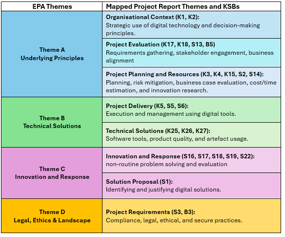
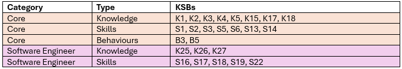
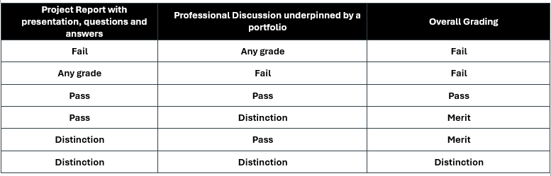
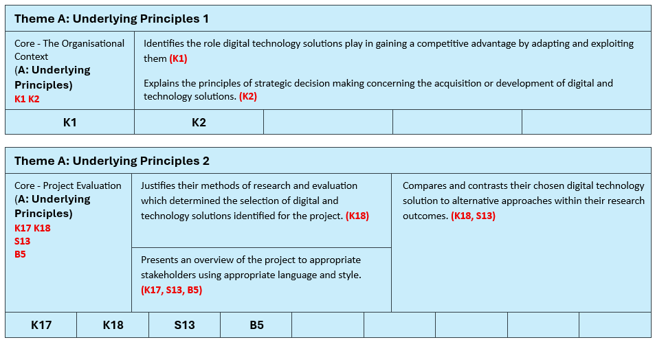
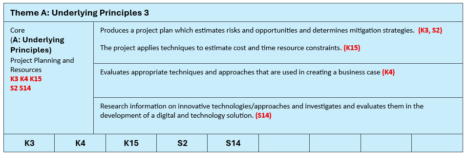
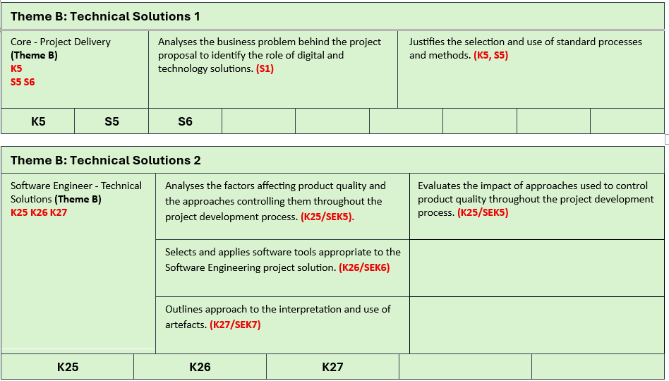
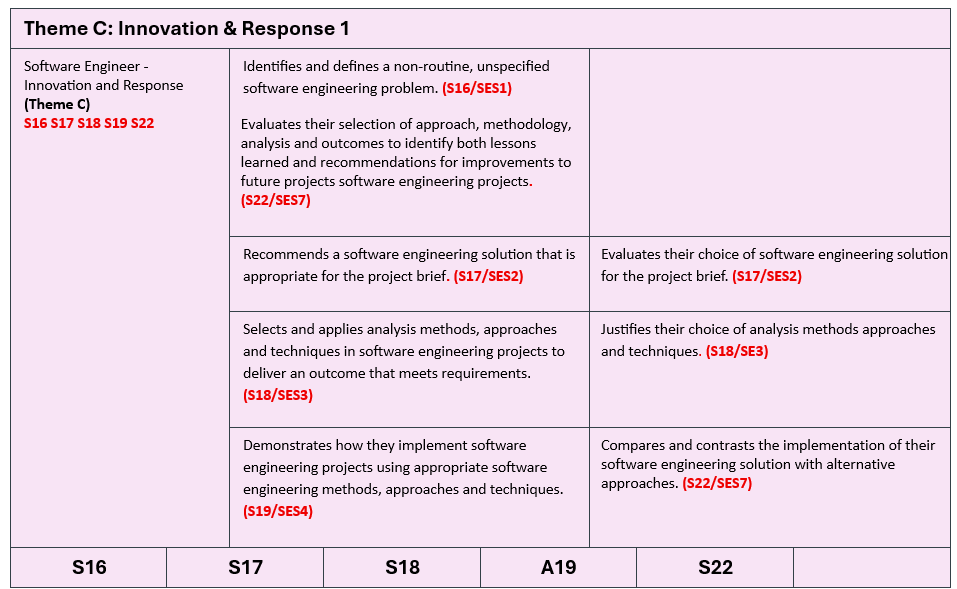
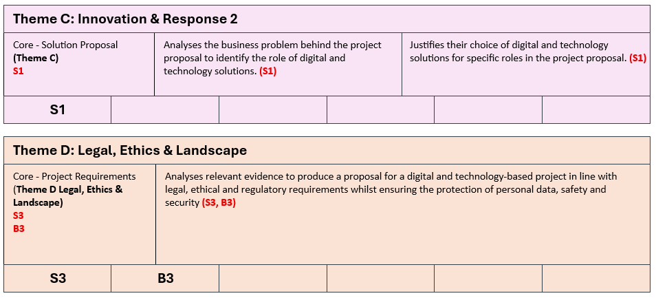

{: .no_toc }

# BDATS - EPA Work Based Project AE1

Solent University, East Park Terrace, Southampton, SO14 0YN   **[End Point Assessor Organisation (EPAO) ID: EPA0325](https://find-epao.apprenticeships.education.gov.uk/courses/25/assessment-organisations/epa0325)**

**Software Engineer**
The primary role of the Software Engineer is to undertake all requirements during the solution development life cycle from gathering requirements to analysis, design, code, build, test, implementation and support. They may also be required to supervise the work of junior software developers and others who may be working on elements of the solution and work with product managers and UX designers in implementing solutions. They will apply software engineering principles to all stages of the solution life cycle, from gathering requirements, undertaking analysis and design, development of code and data requirements whilst also ensuring security feature are addressed. As well as creating new code, they can support existing code by troubleshooting, reverse engineering and conducting root cause analysis. They typically work as part of a large collaborative team and will have responsibility for significant elements of software solutions. [Software Engineer Apprenticeship (ST0119 v1.2) 2023](https://skillsengland.education.gov.uk/apprenticeship-standards/st0119-v1-2)

### Overview
A project involves the apprentice completing a significant and defined piece of work that has a real business application and benefit.

A Digital and Technology Solutions Project may take years, and not all projects experience a full life cycle, sometimes being abandoned for cost reasons or change of business strategy. A Digital Technology Solutions Professional may be one of a multidisciplined team and therefore may not control the timescale of the project.

Therefore, a project (or part project) cannot be designed or delayed to-fit into the EPA timescale nor the specification of the EPAO as results can range from successful new recommendations on process, product or decommission. This cannot be predicted. 

The project must give the apprentice the opportunity to demonstrate the Knowledge, skills and behaviours (KSBs)mapped to this assessment method.

The project must meet the needs of the employer’s business and be relevant to the apprentice’s occupation and apprenticeship. The EPAO must confirm that it provides the apprentice with the opportunity to demonstrate the KSBs mapped to this assessment method to the highest available grade. The EPAO must refer to the grading descriptors to ensure that projects are pitched appropriately.

	<iframe src="https://solent.cloud.panopto.eu/Panopto/Pages/Embed.aspx?id=4fad981f-213e-4320-90b8-b44c00951c7f&autoplay=false&offerviewer=true&showtitle=true&showbrand=true&captions=true&interactivity=all" style="border: 1px solid #464646; position: absolute; top: 0; left: 0; width: 100%; height: 100%; box-sizing: border-box;" allowfullscreen allow="autoplay" aria-label="Panopto Embedded Video Player" aria-description="DTS EPA  AE1 - 1.2"></iframe>

 

Download Project Report with Presentation, Q&A - EPA 1 - AE1 Overview Document

### Project Proposal

{: .note }

> **You only need to complete & submit your Work-based Proposal in COM628. You will submit the 6,000-word report during the EPA period, in COM627 which takes place in the final three months of your apprenticeship.**

The project may be undertaken pre-gateway, however, the Project Report must be completed after the apprentice has gone through the gateway and in the EPA period (3 months approx.)

The apprentice will scope out and provide a summary of what the project will cover and will submit this at the gateway. This should demonstrate that the work-based project report will provide sufficient opportunity for the apprentice to meet the KSBs mapped to this method. The summary is not formally assessed and will typically be no longer than 500 words. The project proposal needs to include a summary of the project plan, research requirements, an overview of how the project will be planned to include timeframes

**How to fill-in and structure the Proposal Template** This walk-though focuses on the Software Engineering pathway to illustrate what is required. If you are on a different pathway, simply download and follow the appropriate proposal template example for your route.

	<iframe src="https://solent.cloud.panopto.eu/Panopto/Pages/Embed.aspx?id=c01b9e8d-c01b-4167-9b04-b359015dff5d&autoplay=false&offerviewer=true&showtitle=true&showbrand=true&captions=true&interactivity=all" style="border: 1px solid #464646; position: absolute; top: 0; left: 0; width: 100%; height: 100%; box-sizing: border-box;" allowfullscreen allow="autoplay" aria-label="Panopto Embedded Video Player" aria-description="EPA Project Proposal AE 1.2"></iframe>

 

Downloads

| Download, fill in & upload temple on the Assessment Page  | Use this example to help complete your Proposal Template |
|-----------|-------------------------------------------------------------------------|
| Project Proposal AE1 Template (Software) | Project Proposal AE1 Example (Software) |

### DTS EPA AE1 - Overview

{: .important }

> **REMEMBER: You only need to complete & submit your Work-based Proposal in COM628. You will submit the 6,000-word report during the EPA period, in COM627 which takes place in the final three months of your apprenticeship.**

 

**This assessment method has 2 components:**
* Project with report
* Presentation with questions and answers

**The apprentice’s project can be based on any of the following:**

* a specific problem
* a recurring issue
* an idea or opportunity

##### Project Report Themes and KSBs

This table outlines the four EPA themes that must be applied in the EPA assessment for the Level 6 Digital and Technology Solutions degree apprenticeship. These themes: **Underlying Principles, Technical Solutions, Innovation and Response, and Legal, Ethics & Landscape** are mapped to the Project Report and Presentation, and each includes a practical summary in the right column to applying relevant **Knowledge, Skills and Behaviours (KSBs). Theme A** focuses on strategic decision-making, stakeholder engagement, and project planning. Theme B covers the delivery and technical execution of digital solutions. **Theme C** highlights innovation, problem-solving, and proposing suitable digital approaches. **Theme D** ensures that legal, ethical, and secure practices are considered throughout the project. Together, these themes provide a structured framework for demonstrating competence across the apprenticeship standard.
 

**KSBs Assessed via Project Report with Presentation, Questions & Answers**

These are KSB learning outcomes that will need to be mapped to in this assessment for full details on KSB Professional Discussion assessment (Appendix A)

**Note:** The documentation within the standard also refers to pathway learning outcomes using different codes; however, these are equivalent to the ones listed below. The following is a consolidated list of the main knowledge and skills outcomes, along with their corresponding pathway learning outcome codes as presented in the standard documentation.

**K25 (SEK5), K26 (SEK6), K27 (SEK7)**
**S16 (SES1), S17 (SES2), S18 (SES3), S19 (SES4), S22 (SES7)**

**KSBs Assessed via Project Report with Presentation, Questions & Answers (AE1)**

This is the first of two EPA assessment elements, and it has its own grading rubric (Appendix B). You’ll receive a grade of Distinction, Pass or Fail for each element, which will contribute to your overall result as shown in the column on the right. A numeric score will also be given for both assessments, and these will be used to calculate your overall degree average and classification in line with university guidelines.

## Project Report Component 1

The **practical side of the project may be carried out before the Gateway.** However, the project report must be completed after the apprentice has passed through the Gateway within the End Point Assessment (EPA). The completed report must be submitted before the end of week 12 of the EPA period (see brief for deadlines)

The apprentice must complete the project and produce all its components independently. **They may work as part of a team, which could include technical support from internal or external sources. However, the project report must be written by the apprentice and reflect their own role and contribution.**

When the report is submitted, both the apprentice and their employer must confirm that it is the apprentice’s own work.

The project report should tell the story of the apprentice’s work from start to finish. It begins with an introduction and sets out the scope of the project, including key performance indicators and how stakeholders were involved. It explains how the outcomes were planned and achieved, supported by a clear project plan. The report should also include any research carried out, the findings, and the final outcomes. It ends with recommendations and a conclusion that reflect the apprentice’s own learning and contribution.

**Assessment Components**

There are two components to this assessment method:

1. **Project Report**

* **Objective:** Demonstrate the apprentice’s knowledge, skills, and behaviours (KSBs).
* **Scope:** Can be based on a specific problem, recurring issue, or opportunity.

**Report Requirements:**

* Must be 6000 words (±10% tolerance).
* Must include a KSB mapping appendix.
* Must be independent work, even if part of a team.
* Submitted by week 12 of the EPA period together with your slide deck for the Professional Discussion Underpinned by portfolio EPA AE2

**Report Structure**

Your report will be supported by a template that includes guidance notes for all the required sections. You will also have access to supporting documents on SOL to help you complete this part of the assessment, along with tutor support through group sessions and individual meetups.

* Cover
* Acknowledgements
* Summary
* Table of Contents
* List of Figures
 
* Introduction
* Project Scope
* Research and Findings
* Requirements   
* Methods, Tools & Technology
* Professional, Legal and Ethical issues
* Project Plan and implementation
* Project Outcomes & Results
* Conclusions and Recommendations
* Reference list
 
**Appendices**
* Appendix A: Knowledge, Skills & Behaviours (KSBs) Mapping
* Appendix B: Employer Reference
* Appendix C: Apprenticeship Statement of Authenticity
* Appendix D: AI Declaration Statement

**Overview of required appendices**

**Appendix A: Knowledge, Skills & Behaviours (KSBs) Mapping**
Use the KSB tables to claim the appropriate knowledge skills and behaviours (KSBs) to address EPA assessment criteria and KSB mapping

**Appendix B: Employer Reference**
The employer must write a reference about the apprentice's performance in the workplace and how they've applied their knowledge, competencies and behaviours in the projects they've been given.

The intent of the employer reference is for you to support your apprentice by validating the evidence that they have submitted for end point assessment (EPA). Project Feedback and Overall Impressions (500 words max.)

**Appendix C: Apprenticeship Statement of Authenticity**
This statement confirms that the work submitted as part of the apprenticeship programme is the original work of the apprentice named below. It has been completed in accordance with the guidelines and expectations of the programme and reflects the apprentice’s own efforts and understanding.

**Appendix D: AI Declaration Statement**
This statement confirms that AI tools were used appropriately in line with Southampton Solent University's AI and AI and academic integrity policy

**Strategies for Demonstrating Knowledge, Skills & Behaviours**

1. **The project must meet the needs of the employer’s business** and be relevant to the apprentice’s occupation and apprenticeship.

2. **Speak and Write in First Person**- Always focus on **your individual contributions** use **“I”** not **“we”** to clearly show your personal contribution. Even in team projects, emphasise your role and decisions Examples: “I volunteered to…”, “I conducted research that informed the decision…”

3. **Be Explicit for the Assessor** - Don’t assume they know your workplace or role. Spell out exactly what you did to meet the KSBs. Anything left unsaid won’t be assessed.

4. **Mirror the Assessment Plan Language** - Adopt phrases directly from the guidance (e.g. “I demonstrated my ability to…”) to make it clear how you've met specific criteria.

5. **Reflect on the What and the Why** - For each example, clearly explain what you did and why you did it. Generic statements are insufficient.

6. **Use Key Phrases to Show Depth** - Clearly explain **decisions, reasoning, and outcomes,** not just the task done. Focus your language around “what” and “why”, such as “I analysed, I evaluated, I implemented... because...” to enhance clarity and impact.

7. **Add Depth for Distinction** - To achieve higher grades, go beyond what you did and reflect on outcomes, emphasise initiative, problem-solving, and measurable results, lessons learned, and how you would refine or improve further. Demonstrate insight into future application and organisational influence.

8. **Evidence Best Practices**

* Use visual evidence (screenshots, dashboards, visuals) wherever possible
* Ensure all images are captioned and relate clearly to your narrative.

 

**Apply GDPR-compliant techniques:**

* Redact sensitive data.
* Anonymise names, addresses, IDs.
* Normalise data to show trends without revealing exact figures.

9. **Demonstrating Competency**

Justify your decisions: e.g., why a tool was chosen or why certain data was excluded.

10. **What NOT to Include**

* Names of others — use initials or job titles.
* Negative remarks or personal commentary.
* Content not directly relevant to demonstrating your professional competency.

**Summary**

| Strategy              | What to do                                      |
|----------------------|-------------------------------------------------|
| First person         | Emphasise your actions and contributions        |
| Explicit detail      | Explain exactly what you did and why            |
| Mirror plan language | Use phrasing from the assessment plan           |
| Legal & Professional | Address all relevant Legal & Professional issues|
| Reflect deeply       | Show insight on decisions and outcomes          |

### Presentation, Questions & Answers Component 2

In the **presentation with questions** the apprentice delivers a presentation of their project lifecycle based on the project report to an independent assessor.  The apprentice must prepare and submit their presentation slides at the same time as the Project Report no later than week 12 of the EPA period.

The apprentice must deliver their presentation to the independent assessor on a one-to-one basis must cover:

* an overview of the project
* the project scope (including key performance indicators)
* summary of actions undertaken by the apprentice
* project outcomes and how these were achieved

 

**Apprentices will be given at least 14 days’ notice of the Presentation with Questions Assessment.**

**Themes:** Questions will explore:
1. Underlying Principles
1. Technical Solutions
1. Innovation & Response
1. Legal, Ethics & Landscape

**Strategies for Demonstrating Knowledge, Skills & Behaviours**

The independent assessor will ask questions following the presentation. This gives the apprentice the opportunity to demonstrate the Knowledge, Skills, and Behaviours (KSBs) mapped to this assessment method.

The purpose of the questions is to explore and verify the apprentice’s understanding of their project area in relation to the apprenticeship standard.

When answering questions and taking part in discussions with the Assessor, the Apprentice should use the same approach as they did when writing their report. This includes the style used in the Professional Discussion in EPA AE2 and is explained in the section above on Strategies for Demonstrating Knowledge, Skills and Behaviours.

**Assessment Structure**

The presentation and questions assessment will:

- Take place online  
- Last **60 minutes***  
- Include a presentation of **30 minutes**  
- Include questioning by the independent assessor (at least **4 questions**)  
- Include **30 minutes of questioning**  
- Include closure: opportunity for final reflections or clarifications  

\* The independent assessor can increase the total time of the presentation and questioning by up to **10%**.  
This allows the apprentice to complete their final point or respond fully to a question if necessary.

**Delivery and Preparation**

The assessment is conducted remotely via video call.

**Apprentices should:**

- Book or be in a **quiet, private room**  
- Use a **computer with a webcam, microphone, and stable internet connection**  
- Have **slides prepared and their report available for reference**  

**Appendix A** The following tables will appear in **Appendix A of the Report Template**. Use them to claim the assessment Knowledge, Skills, and Behaviours (KSBs), ensuring good coverage and alignment with the relevant themes. Remember, you will also be **mapping (tagging)** these within the main body of your report, for example:  
`[K5 S5 S6]`

### Software Engineering - KSB mapping to EPA Assessment Methods (Knowledge)

## Appendix A

The following tables will appear in **Appendix A of the Report Template**. Use them to claim the assessment Knowledge, Skills and Behaviours (KSBs), ensuring good coverage and alignment with the relevant themes.

Remember, you will also be **mapping (tagging)** these within the main body of your report, for example:  
`[K5 S5 S6]`

**Software Engineering – KSB Mapping to EPA Assessment Methods (Knowledge)**

| KSB # | Area                 | Theme                                  | Knowledge |
|------|---------------------|----------------------------------------|-----------|
| K1   | Core                | Theme A: Underlying Principles         | How organisations adapt and exploit digital technology solutions to gain a competitive advantage. |
| K2   | Core                | Theme A: Underlying Principles         | Principles of strategic decision making for acquiring or developing digital and technology solutions (e.g. capability models, target operating models). |
| K3   | Core                | Theme A: Underlying Principles         | Principles of estimating risks and opportunities of digital and technology solutions. |
| K4   | Core                | Theme A: Underlying Principles         | Techniques for creating a business case (e.g. journey mapping, product mapping, value chains). |
| K5   | Core                | Theme B: Technical Solutions           | A range of digital technology solution development techniques and tools. |
| K15  | Core                | Theme A: Underlying Principles         | Principles of estimating cost, time, and resource constraints. |
| K17  | Core                | Theme A: Underlying Principles         | Reporting techniques, including synthesising and presenting information concisely. |
| K18  | Core                | Theme A: Underlying Principles         | Justification of research and evaluation methods used to select solutions. |
| K25  | Software Engineering | Theme B: Technical Solutions          | Factors affecting product quality (e.g. security, code quality, standards). |
| K26  | Software Engineering | Theme B: Technical Solutions          | Selection and application of software engineering tools. |
| K27  | Software Engineering | Theme B: Technical Solutions          | Interpretation and use of artefacts (e.g. UML, unit tests, architecture). |

**Software Engineering – KSB Mapping to EPA Assessment Methods (Skills)**

| KSB # | Area                 | Theme                                  | Skill |
|------|---------------------|----------------------------------------|-------|
| S1   | Core                | Theme C: Innovation and Response        | Analyse a business problem to identify the role of digital and technology solutions. |
| S2   | Core                | Theme A: Underlying Principles          | Identify risks, mitigation strategies, and improvement opportunities. |
| S3   | Core                | Theme D: Legal, Ethics & Landscape      | Analyse a business problem to specify an appropriate solution. |
| S5   | Core                | Theme B: Technical Solutions            | Apply standard processes, methods, and tools (e.g. Agile, Waterfall, ISO). |
| S6   | Core                | Theme B: Technical Solutions            | Manage projects, resolve deviations, apply project management methodologies. |
| S13  | Core                | Theme A: Underlying Principles          | Report effectively to stakeholders using appropriate language and style. |
| S14  | Core                | Theme A: Underlying Principles          | Research and evaluate innovative technologies or approaches. |
| S16  | Software Engineering | Theme C: Innovation and Response       | Identify and define non-routine software engineering problems. |
| S17  | Software Engineering | Theme C: Innovation and Response       | Recommend appropriate software engineering solutions. |
| S18  | Software Engineering | Theme C: Innovation and Response       | Use appropriate analysis methods to meet requirements. |
| S19  | Software Engineering | Theme C: Innovation and Response       | Implement software engineering projects using suitable methods. |
| S22  | Software Engineering | Theme C: Innovation and Response       | Evaluate learning points and produce recommendations for future improvements. |

**Software Engineering – KSB Mapping to EPA Assessment Methods (Behaviours)**

| KSB # | Area | Theme                             | Behaviour |
|------|------|----------------------------------|-----------|
| B3   | Core | Theme D: Legal, Ethics & Landscape | Acts with integrity, ensuring ethical, legal, and regulatory compliance including data protection and security. |
| B5   | Core | Theme A: Underlying Principles| nteracts professionally with people from technical and non-technical backgrounds. Presents data and conclusions in an evidently truthful, concise and appropriate manner. |

**Appendix B**

**Grading - Project Report with Presentation, Questions & Answers**
This grading rubric applies to the **Project Report with Presentation, Questions & Answers assessment**

Your Project Report will be submitted at the end of the EPA period together with the slide deck to be use in Presentation, Questions & Answers assessment

It is essential that:

Your Reporting aligns directly with the specified KSBs.

* You are prepared to expand on and clarify how your work demonstrates these KSBs during the discussion.
* This ensures that assessors can confidently evaluate your competence against both Pass and Distinction criteria.

## KSB Assessment Criteria Mapping

| Theme | KSBs | Pass (All must be demonstrated) | Distinction (All pass + distinction required) |
|------|------|----------------------------------|----------------------------------------------|
| **Core – The Organisational Context (Theme A: Underlying Principles)** | K1 K2 | Identifies the role digital technology solutions play in gaining a competitive advantage (K1). Explains principles of strategic decision making for acquiring/developing solutions (K2). | N/A |
| **Core – Project Evaluation (Theme A: Underlying Principles)** | K17 K18 S13 B5 | Justifies methods of research and evaluation used to select solutions (K18). Presents project overview effectively to stakeholders (K17, S13, B5). | Compares and contrasts chosen solution with alternatives from research (K18, S13). |
| **Core – Project Planning and Resources (Theme A: Underlying Principles)** | K3 K4 K15 S2 S14 | Produces a project plan with risk estimation and mitigation (K3, S2). Evaluates business case techniques (K4). Applies cost/time estimation (K15). Researches and evaluates innovative technologies (S14). | N/A |
| **Core – Project Delivery (Theme B: Technical Solutions)** | K5 S5 S6 | Analyses the business problem underpinning the proposal (K5, S5). Manages project delivery (S6). | Justifies selection and use of standard processes and methods (K5, S5). |
| **Software Engineer – Technical Solutions (Theme B: Technical Solutions)** | K25 K26 K27 | Analyses factors affecting product quality (K25). Selects and applies appropriate tools (K26). Outlines approach to artefacts (K27). | Evaluates impact of quality control approaches (K25). |
| **Core – Solution Proposal (Theme C: Innovation and Response)** | S1 | Analyses business problem to identify role of digital solutions (S1). | Justifies choice of digital technology solutions (S1). |
| **Software Engineer – Innovation and Response (Theme C: Innovation and Response)** | S16 S17 S18 S19 S22 | Defines non-routine problem (S16). Recommends appropriate solution (S17). Applies analysis methods (S18). Implements solution (S19). Evaluates outcomes and lessons learned (S22). | Evaluates solution choice (S17). Justifies analysis methods (S18). Compares implementation with alternatives (S22). |
| **Core Project Requirements (Theme D Legal, Ethics & Landscape)** | S3 B3 | Analyses relevant evidence to produce a proposal for a digital and technology-based project in line with legal, ethical and regulatory requirements whilst ensuring the protection of personal data, safety and security (S3, B3) |N/A |

**Appendix C**

**Project Report with Presentation, Questions & Answers Mapping Blocks**

KSB mapping blocks are tools to help you align your reporting with the specific Knowledge, Skills, and Behaviours (KSBs) required by the assessment criteria. You don’t need to include them in your report, as you’ll ‘claim’ these in Appendix A – KSB Mapping to EPA Assessment. However, they will help you visualise the Themes, KSBs, and criteria, making sure your report clearly shows how it meets the relevant standards.

