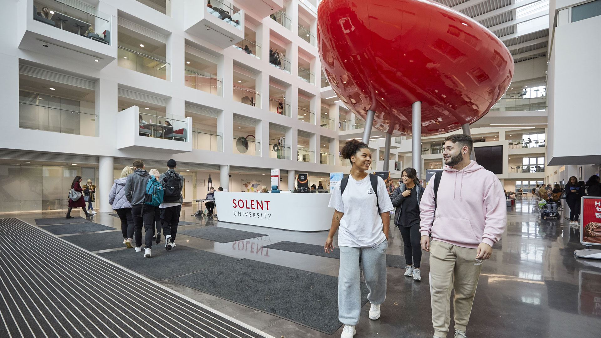
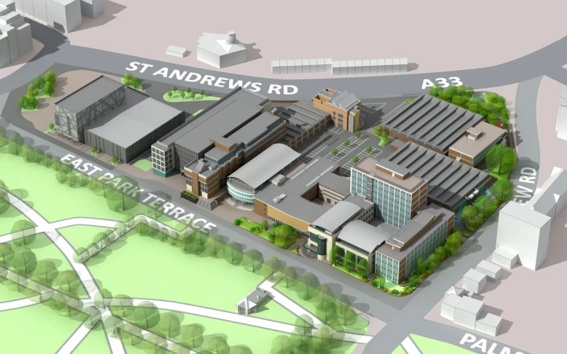
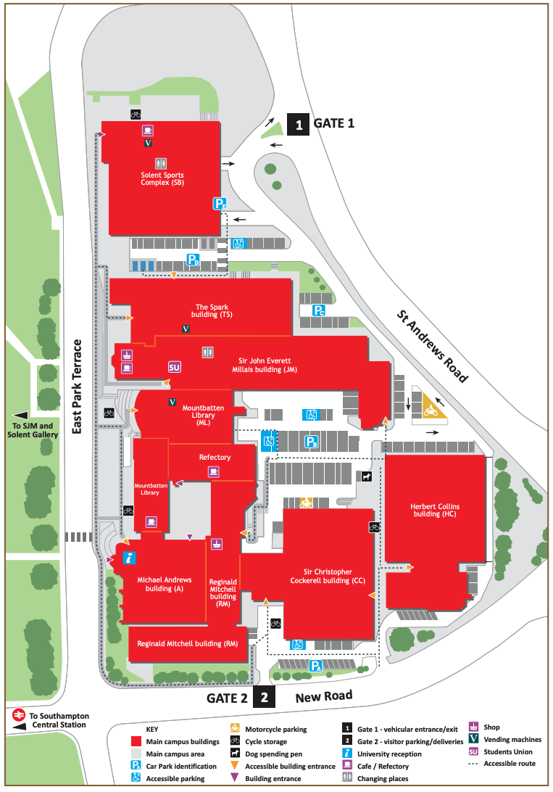
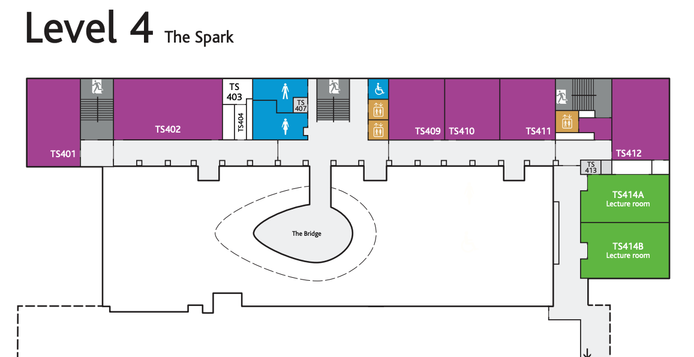

{: .no_toc } 

# Computing and Digital Apprentice Induction

**Apprenticeship induction takes place on campus** a weeks before the start of term. Induction day is an opportunity for apprentices to meet tutors, learn more about delivery of the course and an opportunity to tour the campus.

**Wednesday 17th September 2025 Times TBC**

	<iframe src="https://solent.cloud.panopto.eu/Panopto/Pages/Embed.aspx?id=602e0202-f37c-41f3-b024-b35800869f0d&autoplay=false&offerviewer=true&showtitle=true&showbrand=true&captions=true&interactivity=all" style="border: 1px solid #464646; position: absolute; top: 0; left: 0; width: 100%; height: 100%; box-sizing: border-box;" allowfullscreen allow="autoplay" aria-label="Panopto Embedded Video Player" aria-description="DTS SE Induction - Sept 2025"></iframe>

[Induction Slides 2025](./info/BDATS_INDUCTION_2025-26_v2.pptx)

[Understanding Your Timetable](./info/Understanding%20Your%20Timetable%20-%202025.pdf)

### East Park Terrace Campus

### East Park Terrace Plan

[East Park Terrace Campus Map](./info/east-park-terrace-campus-map.pdf)

### Campus: East Park Terrace, Southampton SO14 0YN

[solent.ac.uk/about/find-us](https://www.solent.ac.uk/about/find-us)

<iframe src="https://www.google.com/maps/embed?pb=!1m18!1m12!1m3!1d2515.8322225061675!2d-1.402574148061115!3d50.908320479440754!2m3!1f0!2f0!3f0!3m2!1i1024!2i768!4f13.1!3m3!1m2!1s0x487476b1943c33e9%3A0x7b3d2a7c433db059!2sSolent%20University!5e0!3m2!1sen!2suk!4v1658263361358!5m2!1sen!2suk" width="600" height="450" style="border:0;" allowfullscreen="" loading="lazy" referrerpolicy="no-referrer-when-downgrade"></iframe>

<!--

## Agenda

9.00 Registration with Admissions

10.00 – 10.30 Apprenticeship team

* What is an Apprenticeship?
* Why are you special?
* Off the job trackers
* Progress reviews
* End Point Assessment

10.30 - 10.45 Library Services

11.00 - 11.15 Access Solent

11.15 – 11.30 Solent Futures

11.30 – 11.45 Therapy and Mental Health

11.45 – 12.00 Safeguarding

12.00 - 13.00 Bystander Training with Yellow door

**BREAK**

**Computing Course Team Induction**

14.00 - 16:00 Course Lead Induction JM412 Usability Lab

Directions JM412:

1. Take lift outside the Deli and Student Union Office to 4th Floor Sir John Everett Millais building (JM) Building.
1. Turn left out of the lift.
1. Follow the corridor.
1. JM412 will be on the right.

### Campus: East Park Terrace, Southampton SO14 0YN

[solent.ac.uk/about/find-us](https://www.solent.ac.uk/about/find-us)

<iframe src="https://www.google.com/maps/embed?pb=!1m18!1m12!1m3!1d2515.8322225061675!2d-1.402574148061115!3d50.908320479440754!2m3!1f0!2f0!3f0!3m2!1i1024!2i768!4f13.1!3m3!1m2!1s0x487476b1943c33e9%3A0x7b3d2a7c433db059!2sSolent%20University!5e0!3m2!1sen!2suk!4v1658263361358!5m2!1sen!2suk" width="600" height="450" style="border:0;" allowfullscreen="" loading="lazy" referrerpolicy="no-referrer-when-downgrade"></iframe>

[Campus Map](https://github.com/martinsolent/solent_store/raw/main/docs/east-park-terrace-campus-map.pdf){: .btn .btn-purple }

[Download Induction Slides 2023-24](info/BDATS_INDUCTION_2023-24.pptx){: .btn .btn-purple }

1. Arrival in TS412 - 10:00-10.20
2. Introduction - 10:20-10:30 
3. Course Presentation - 10:30-11:30
4. Q&A - 11:30-11:50
5. Registration in Spark - 12:00-12:30
6. Break - 12:30-13:30
7. Campus Tour - 13:40-14:40

### Campus: East Park Terrace, Southampton SO14 0YN

[solent.ac.uk/about/find-us](https://www.solent.ac.uk/about/find-us)

<iframe src="https://www.google.com/maps/embed?pb=!1m18!1m12!1m3!1d2515.8322225061675!2d-1.402574148061115!3d50.908320479440754!2m3!1f0!2f0!3f0!3m2!1i1024!2i768!4f13.1!3m3!1m2!1s0x487476b1943c33e9%3A0x7b3d2a7c433db059!2sSolent%20University!5e0!3m2!1sen!2suk!4v1658263361358!5m2!1sen!2suk" width="600" height="450" style="border:0;" allowfullscreen="" loading="lazy" referrerpolicy="no-referrer-when-downgrade"></iframe>

[Spark Building Plan](https://github.com/martinsolent/solent_store/raw/main/the-spark-room-guide-and-map.pdf){: .btn .btn-purple }

### Induction Presentation

<iframe src="https://solent.cloud.panopto.eu/Panopto/Pages/Embed.aspx?id=b0b14943-b23a-4114-8a28-ada801008324&autoplay=false&offerviewer=true&showtitle=true&showbrand=true&captions=true&interactivity=all" height="405" width="720" style="border: 1px solid #464646;" allowfullscreen allow="autoplay"></iframe>

-->
