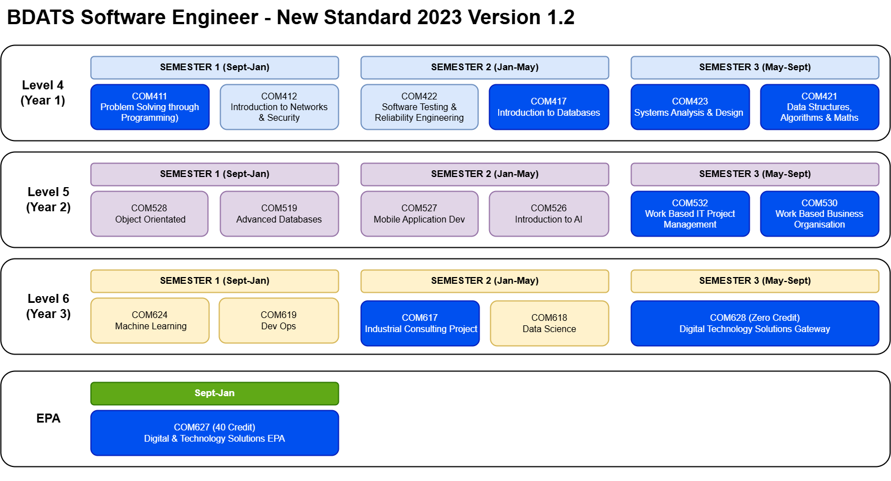

{: .no_toc }

# DTS Module Delivery

**Software Engineer** 20 Credit non-block delevery 2026 starters

| **BDATS** | Software Engineering|
| --- | --- |
| **Level 4** | |
| **SEM 1** | **Sept - Jan** |
| COM411 | Problem Solving Through Programming |
| COM412 | Intro to Networks and Security |
| **SEM 2** | **Jan - May** |
| COM430| Introduction to Databases |
| COM422 | Software Testing and Reliability Engineering |
| **SEM 3** | **May - Sept** |
| COM423 | Systems Analysis & Design  |
| COM431 | Data Structures, Algorithms & Maths |
| **Level 5** |  |
| **SEM 1** | **Sept - Jan** |
| COM519 | Advanced Database Systems |
| COM534 | Object Oriented Development |
| **SEM 2** | **Jan - May** |
| COM526 | Introduction to AI |
| COM527 | Mobile Application Development |
| **SEM 3** | **May - Sept** |
| COM532 | Work Based IT Project Management |
| COM530 | Work Based Business Organisation |
| **Level 6** | |
| **SEM 1** | Sept - Jan |
| COM624 | Machine Learning |
| COM619 | DevOps |
| **SEM 2** | **Jan - May** |
| COM617 | Industrial Consulting Project |
| COM618 | Data Science |
| **SEM 3** | **May - Sept** |
| COM628 | Gateway (Zero Credit Module EPA Prep) |
| **EPA** | **Oct- Jan** |
| COM627 | End Point Assessment (40 Credits) |

### *Modules with embedded CISCO Training

COM412 - [CISCO CCNA 1](https://www.netacad.com/courses/networking/ccna-introduction-networks)

