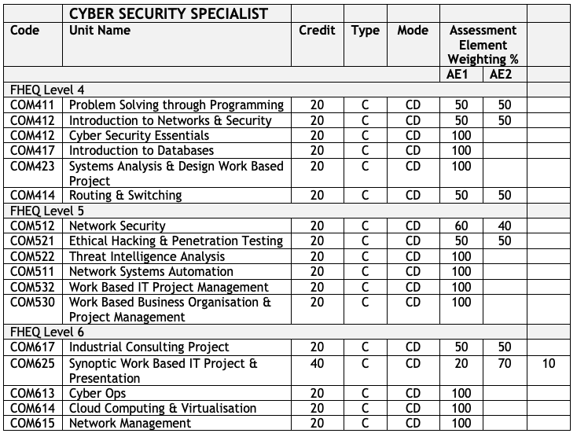

{: .no_toc }

#  BDATS - Cybersecurity Specialist

A cyber security analyst is responsible for the implementation, maintenance and support of the security controls that protect an organisation’s systems and data assets from threats and hazards. They ensure that security technologies and practices are operating in accordance with the organisation’s policies and standards to provide continued protection. They require a broad understanding of network infrastructure, software and data to identify where threat and hazard can occur. They are responsible for performing periodic vulnerability assessments to evaluate the organisation’s ongoing security posture and will provide visibility to management of the main risks and control status on an ongoing basis. They respond to security incidents and implement resolution activities across the organisation.

### Skills

**Be able to:**

* Analyse and evaluate security threats and vulnerabilities to planned and installed information systems or services and identify how these can be mitigated against.
* Perform security risk assessments for a range of information systems and propose solutions.
* Develop a security case against recognised security threats, and recommend mitigation, security controls and appropriate processes.
* Define and justify a user access policy for an information system given knowledge of the system architecture, security requirements and threat/risk environment. This should be in terms of what they can do, resources they can access, and operations they are allowed to perform.
* Perform a business impact analysis in response to a security incident and follow a disaster recovery plan to meet elements of a given business continuity policy.
* Conduct a range of cyber security audit activities to demonstrate security control effectiveness

### Technical Knowledge

**Knows and understands:**

* The types of security (confidentiality, authentication; non-repudiation; service integrity) and security big picture (network security; host OS security; physical security).
* The main types of common attack techniques, including phishing, social engineering, malware, network interception, blended techniques, denial of service and theft.
* How to recognise and assess risk including performing a risk assessment.
* How to apply penetration testing effectively and how it contributes to assurance.
* The different approaches to risk treatment and management in practice.
* What the ‘cyber security culture’ in an organisation is, and how it may contribute to security risk.

### Level 4 - 1st Year - September Start 

| **Winter - Sept - Jan (12 Weeks of Teaching)** |
|:--------------------------------------------|
| COM411 - Problem Solving through Programming |
| COM412* - Introduction to Networks & Security | 
| **Spring - Jan - May (12 Weeks of Teaching)** |
| COM415 Cyber Security Essentials |
| COM417 - Introduction to Databases| 
|**Summer - May - Sept (8 Weeks of Teaching)**|
|COM423 - Systems Analysis & Design Work Based Project|
|COM414* Routing & Switching|

### Level 5 - 2nd Year - September Start

|**Winter - Sept - Jan (12 Weeks of Teaching)**|
|:--------------------------------------------|
|COM521 Ethical Hacking & Pen Testing |
|COM511 Network Systems Automation |
|**Spring - Jan - May (12 Weeks of Teaching)**|
|COM512 Network Security* | 
|COM522 Threat Intelligence Analysis|
|**Summer - May - Sept (8 Weeks of Teaching)**|
|COM532 - Work Based IT Project Management|
|COM530 - Work Based Business Organisation |

### Level 6 - 3rd Year - September Start

|**Winter - Sept - Jan(12 Weeks of Teaching)**|
|:--------------------------------------------|
|COM613 CyberOps* |
|COM615 Network Management |
|**Spring - Jan - May (12 Weeks of Teaching)**|
|COM614 Cloud Computing | 
|COM617 - Industrial Consulting Project|
|**Summer - May - Sept (8 Weeks of Teaching)**|
|COM625 - Synoptic Work Based IT Project|

### *Modules with embedded CISCO Training

COM412 - [CISCO CCNA 1](https://www.netacad.com/courses/networking/ccna-introduction-networks)

COM414 - [CISCO CCNA 2](https://www.netacad.com/courses/networking/ccna-switching-routing-wireless-essentials)

COM512 - [CISCO Network Security](https://www.netacad.com/courses/cybersecurity/network-security)

COM513 - [Model Driven Programming & CCNA exam](https://www.netacad.com/courses/infrastructure-automation/workshop-model-driven-programmability)

COM515 - [CISCO CCNA 3](https://www.netacad.com/courses/networking/ccna-enterprise-networking-security-automation)

COM612 - [CISCO Connecting Things](https://www.netacad.com/courses/iot/iot-fundamentals)

COM613 - [CISCO Cyber Operations](https://www.netacad.com/courses/cybersecurity/cyberops-associate)
