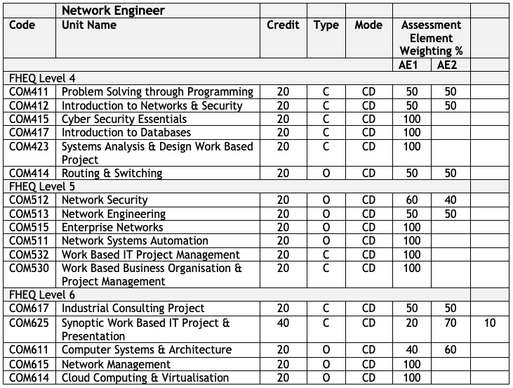

{: .no_toc }

#  BDATS - Network Engineer

The primary role of a network engineer is to design, install, maintain and support communication networks within an organisation or between organisations. They need to maintain high levels of network performance and availability for users. They must also understand network configuration, cloud, network administration, and monitoring tools, and be able to give technical advice and guidance. Network engineers must be proficient in technology solutions to be able to analyse system requirements to ensure the network and its services operate to desired levels. Network engineers also understand data traffic and transmission across the network and have a major role to play in ensuring network security.

### Skills 

**Be able to:**

* Plan, design, build and test a simple network to a requirement specification that includes hubs, switches, routers and wireless user devices, applying appropriate security products and processes.
* Identify the key characteristics of a new network service and develop estimates of the expected traffic intensity and traffic load that the network must support.
* Determine the minimum network capacity of planned networks to meet network requirements.
* Design, build, test, configure and optimise a distributed network (more than 1 sub- net), including switches, routers and firewalls to meet given requirements.
* Analyse network performance and troubleshoot typical problems in networks.
* Identify and evaluate network security risks and incorporate appropriate security products and processes into network designs to increase security, resilience and dependability.

### Technical Knowledge

* Knows and understands:

* The  fundamental    building   blocks   (e.g.   routers, switches, hubs, storage, transmission) and typical architectures (e.g. server/client, hub/spoke) of computers, networks and the Internet.
* The main  features  of  routing  and  Internet  network protocols in use, their purpose and relationship to each other, including the physical and data link layer  (e.g. https, HTTP, SMTP, SNMP, TCP, IP, etc.).
* The main factors that affect network performance (e.g. the relationship between bandwidth, number of users, nature of traffic, contention).
* Failure modes in protocols (e.g. why a protocol may ‘hang’ and the effect of data communication errors).
* The ways to improve performance (e.g. application of traffic shaping, changes to architecture to avoid bottlenecks, network policy that prohibit streaming protocols).
* The issues that may arise in the day to day operation of networks and how to resolve them.

## Course Delivery - Network Engineer

### Level 4 - 1st Year - September Start 

| **Winter - Sept - Jan (12 Weeks of Teaching)** |
|:--------------------------------------------|
| COM411 - Problem Solving through Programming |
| COM412 - Introduction to Networks & Security* | 
| **Spring - Jan - May(12 Weeks of Teaching)** |
| COM415 Cyber Security Essentials |
| COM417 - Introduction to Databases                  | 
|**Summer - May - Sept (8 Weeks of Teaching)**|
|COM423 - Systems Analysis & Design Work Based Project|
|COM414 Routing & Switching*|

### Level 5 - 2nd Year - September Start

|**Winter - Sept - Jan (12 Weeks of Teaching)**|
|:--------------------------------------------|
|COM515 - Enterprise Networks* |
|COM511 Network Systems Automation |
|**Spring - Jan - May (12 Weeks of Teaching)**|
|COM512 Network Security* | 
|COM513 - Network Engineering*|
|**Summer - May - Sept (8 Weeks of Teaching)**|
|COM532 - Work Based IT Project Management|
|COM530 - Work Based Business Organisation |

### Level 6 - 3rd Year - September Start

|**Winter - Sept - Jan (12 Weeks of Teaching)**|
|:--------------------------------------------|
|COM611 - Computer Systems & Architecture |
|COM615 Network Management |
|**Spring - Jan - May (12 Weeks of Teaching)**|
|COM614 Cloud Computing | 
|COM617 - Industrial Consulting Project|
|**Summer - May - Sept (8 Weeks of Teaching)**|
|COM625 - Synoptic Work Based IT Project|

### *Modules with embedded CISCO Training

COM412 - [CISCO CCNA 1](https://www.netacad.com/courses/networking/ccna-introduction-networks)

COM414 - [CISCO CCNA 2](https://www.netacad.com/courses/networking/ccna-switching-routing-wireless-essentials)

COM512 - [CISCO Network Security](https://www.netacad.com/courses/cybersecurity/network-security)

COM513 - [Model Driven Programming & CCNA exam](https://www.netacad.com/courses/infrastructure-automation/workshop-model-driven-programmability)

COM515 - [CISCO CCNA 3](https://www.netacad.com/courses/networking/ccna-enterprise-networking-security-automation)