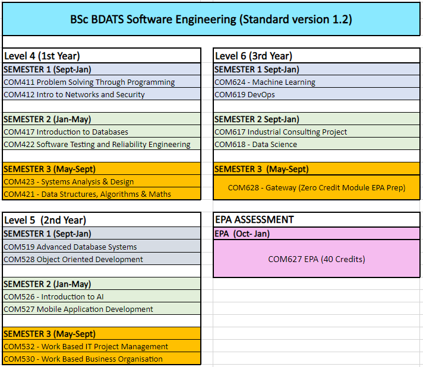

{: .no_toc }

#  BDATS Pathways

The Solent University BDATS Apprenticeship currently offers the **Software Engineer** pathway.

**Reference:** ST0119
**Version:** 1.2
**Level:** 6
**Degree:** Integrated degree

[BDATS Standard](https://www.instituteforapprenticeships.org/apprenticeship-standards/digital-and-technology-solutions-professional-integrated-degree/){: .btn .btn-purple } 

