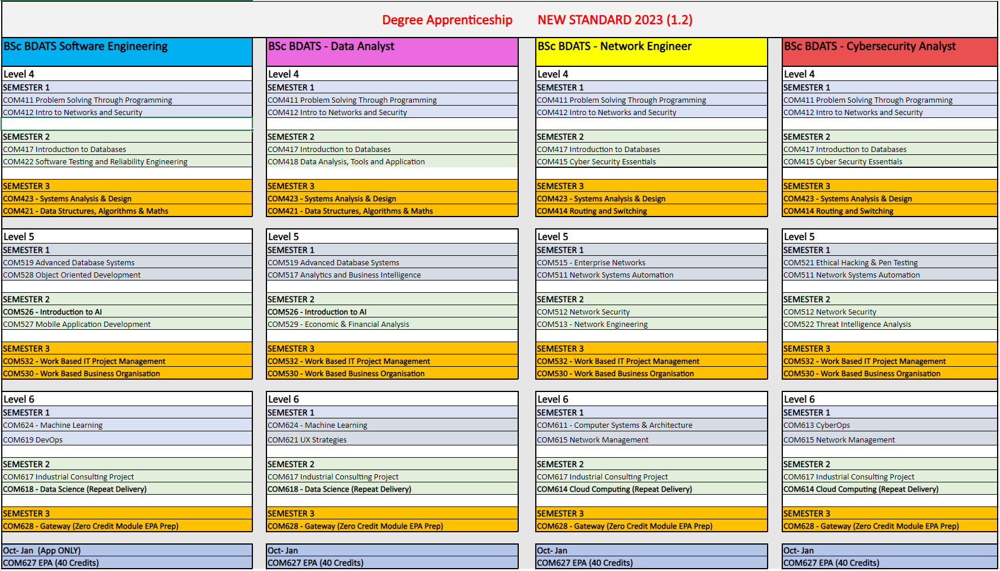

{: .no_toc }

#  BDATS Pathways

The Solent University BDATS Apprenticeship offers four pathways depending on your job role **NO FIRST YEAR intake for DATA ANALYST for Sept 2024.**

Option 1: **Software Engineer**
Option 4: **Cyber Security Analyst**
Option 5: **Data Analyst**
Option 6: **Network Engineer**

**Reference:** ST0119
**Version:** 1.2
**Level:** 6
**Degree:** integrated degree

[BDATS Standard](https://www.instituteforapprenticeships.org/apprenticeship-standards/digital-and-technology-solutions-professional-integrated-degree/){: .btn .btn-purple } 

