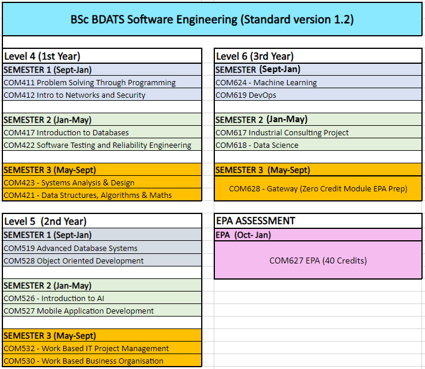

#  BDATS Pathways

The Solent University BDATS Apprenticeship currently offers the **Software Engineer** pathway.

[Go to SE module delivery](https://martinsolent.github.io/bdats_2/docs/modules/)

**Reference:** ST0119
**Version:** 1.2
**Level:** 6
**Degree:** Integrated degree

[BDATS Standard](https://skillsengland.education.gov.uk/apprenticeships/st0119-v1-2){: .btn .btn-purple } 

