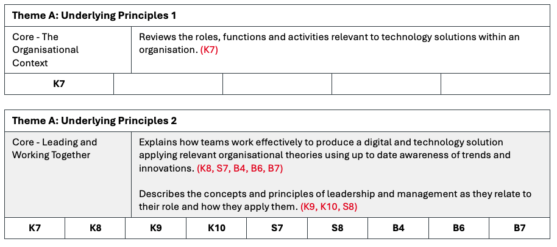

{: .no_toc }

# Cyber Security Portfolio
*A Cyber Security Analyst leads in the work to define, implement and maintain security products and systems within an organisation’s policies and service level agreements. They will need to analyse and understand the points of vulnerability within IT systems and a proactive and agile approach to maintain high levels of systems and organisational security. They will monitor security performance using tools, statistical reporting and analysis, using the output of monitoring to problem solve, propose improvements and implement changes to meet service level requirements. A Cyber Security Analyst leads technical implementation of security infrastructures and technical designs, including producing cost and timescale estimates and identifying risks. After implementation they take ownership for obtaining the information required to diagnose and resolve more complex problems and escalations such as security incidents and business recovery. They engage with third parties to jointly resolve in-depth product issues where necessary and completing cyber risk assessments.*
[Cyber Security Analyst Apprenticeship ST0119 v1.2 2023](https://skillsengland.education.gov.uk/apprenticeship-standards/st0119-v1-2)

## EPA Portfolio Assessment (Cyber Security) AI Podcast

<iframe src="https://solent.cloud.panopto.eu/Panopto/Pages/Embed.aspx?id=2de4ddc6-9e42-46b1-9982-b34100cbce48&autoplay=false&offerviewer=true&showtitle=true&showbrand=true&captions=true&interactivity=all" height="405" width="720" style="border: 1px solid #464646;" allowfullscreen allow="autoplay" aria-label="Panopto Embedded Video Player" aria-description="EPA Portfolio NotebookLM Podcast Cyber" ></iframe>

This [Google NotebookLM](https://notebooklm.google/) AI generated podcast explains how software engineering apprentices can prepare their portfolio and professional discussion for the second assessment element of the End-Point Assessment (EPA) in the Digital and Technology Solutions apprenticeship.

It covers:

* Purpose of the portfolio – a curated set of six real-world evidence items demonstrating knowledge, skills, and behaviours (KSBs), mapped to the apprenticeship standard.

* Key themes – cyber security & development, ethical/legal compliance, organisational/business teamwork, and responding to change/innovation.

* Best practices – use first-person accounts, be explicit about your contribution, include visual evidence with captions, anonymise sensitive data, and explain both what you did and why.

* Common mistakes – being too generic, omitting the “why,” including irrelevant or unprofessional content.

* Role of the portfolio – it’s not graded directly but is the foundation for the professional discussion.

* Professional discussion format – 60 minutes, four main themes, assessor-led but apprentice-driven, using the portfolio to evidence competencies.

* Distinction tips – show reflection, measurable results, lessons learned, and growth from challenges.

* Example case – developing a web-based reporting tool in an agile environment, evidencing KSBs through active participation, leadership, and measurable impact.

The video emphasises framing the portfolio as a strategic story to support confident, evidence-backed discussion with the assessor.

## Cyber Security Portfolio Overview and Support

<iframe src="https://solent.cloud.panopto.eu/Panopto/Pages/Embed.aspx?id=691c166b-8f48-4c46-a06d-b34100e7d352&autoplay=false&offerviewer=true&showtitle=true&showbrand=true&captions=true&interactivity=all" height="405" width="720" style="border: 1px solid #464646;" allowfullscreen allow="autoplay" aria-label="Panopto Embedded Video Player" aria-description="EPA Cyber Portfolio AE2 Overview" ></iframe>

[Download EPA Professional Discussion Portfolio 1.2 Overview](../info/epa_1-2_doc_2025/DATS_CYBER_1-2_EPA-Portfolio_Support_2025_v2.pdf)

Your portfolio should evidence your competence against the KSBs listed in the standard.
It must be mapped to six distinct items, each showcasing different aspects of your role and learning.

Choose projects that cover a range of activities, such as:
* Cyber Security
* Ethical and legal compliance
* Organisational, business and team collaboration

Ensure all examples are authentic, anonymised if necessary and have organisation clearance to submit.

Explain why you did it, what you learned, and how it impacted the project or organisation.
Use reflective writing to show growth and understanding.

Include examples that show how your skills have developed over time.
Highlight how you’ve responded to feedback or adapted to new challenges.

Be ready to talk through each item, justify your decisions, and explain how they meet the KSBs.
Practice answering questions that ask you to expand, clarify, or compare your work.
 
## Portfolio Evidence Overview (6x items)

This section provides a structured list of example portfolio evidence items, grouped under the four End-Point Assessment (EPA) themes defined in the ST0119 (version 1.2) apprenticeship standard. These examples are designed to support apprentices and employers in identifying suitable work-based projects and artefacts that demonstrate the required Knowledge, Skills, and Behaviours (KSBs).

Each theme reflects a key area of competence: The portfolio items listed under each theme are examples only and should be adapted to reflect the apprentice’s actual work and context. They are intended to guide the development of a strong, well-evidenced portfolio that supports a successful EPA. The apprenticeship standard outlines both core and pathway duties, each comprising a set of Knowledge, Skills, and Behaviours (KSBs) aligned to specific criteria or activities. These may also be helpful when selecting appropriate portfolio items for documentation.

Throughout the apprenticeship you will need to collate a portfolio of work mapped to the Standard’s KSBs, in Gateway COM628 module, the final on-programme module in 3rd (Level 6), you will submit a Portfolio of select a final 6 discrete pieces for the Professional Discussion underpinned by a portfolio assessment element 2 (AE2)

* apprentices must compile a portfolio of evidence during the on-programme period of the apprenticeship.

* it must contain evidence related to the KSBs that will be assessed by the professional discussion.

* the portfolio of evidence will typically contain 6 discrete pieces of evidence.

* evidence must be mapped against the KSBs.

* evidence may be used to demonstrate more than one KSB; a qualitative as opposed to quantitative approach is suggested.

* evidence sources may include:

* workplace documentation/records, for example workplace policies/procedures, records

* witness statements

* assignments

* annotated photographs

* video clips (maximum total duration 10 minutes); the apprentice must be in view and identifiable.

**This is not a definitive list; other evidence sources are possible.**

* **Although it is expected that apprentices at degree level will be reflective in their practice, it should be noted that the EPA assesses individuals on evidence of output against the KSBs, not reflective accounts, or any methods of self-assessment.**

* any employer contributions should focus on direct observation of performance (for example witness statements) rather than opinions.

* the evidence provided must be valid and attributable to the apprentice; the portfolio of evidence must contain a statement from the employer and apprentice confirming this.

* the portfolio of evidence must be submitted to the EPAO at the gateway.

**The portfolio of evidence is not directly assessed. It underpins the professional discussion and will not be marked by the EPAO (Southampton Solent University). Solent will review the portfolio of evidence in preparation for the professional discussion but is not required to provide feedback after this portfolio review.**
 
### Strategies for Demonstrating Knowledge, Skills & Behaviours

1.	**Use real-world, work-based examples** only no academic tasks, hobby projects, or generic online learning examples.

2.	**Speak and Write in First Person** - Always focus on **your individual contributions** use **“I”** not **“we”** to clearly show your personal contribution. Even in team projects, emphasise your role and decisions.
Examples: **“I volunteered to…”, “I conducted research that informed the decision…”**

3.	**Be Explicit for the Assessor** - Don’t assume they know your workplace or role. Spell out exactly what you did to meet the KSBs. Anything left unsaid won’t be assessed. 

4.	**Mirror the Assessment Plan Language** - Adopt phrases directly from the guidance (e.g. “I demonstrated my ability to…”) to make it clear how you've met specific criteria. 

5.	**Reflect on the What and the Why** - For each example, clearly explain what you did and why you did it. Generic statements are insufficient. 

6.	**Use Key Phrases to Show Depth** - Clearly explain decisions, reasoning, and outcomes, not just the task done. Focus your language around **“what”** and **“why”**, such as **“I analysed, I evaluated, I implemented... because...”** to enhance clarity and impact. 

7.	**Add Depth for Distinction** - To achieve higher grades, go beyond what you did and reflect on outcomes, emphasise initiative, problem-solving, and measurable results, lessons learned, and how you would refine or improve further. Demonstrate insight into future application and organisational influence.

8.	**Evidence Best Practices**
* **Use visual evidence** (screenshots, dashboards, visuals) wherever possible
* Ensure all images are **captioned** and relate clearly to your narrative.
* Apply **GDPR-compliant techniques:**
* **Redact** sensitive data.
* **Anonymise names**, addresses, IDs.
* **Normalise data** to show trends without revealing exact figures.

9.	**Demonstrating Competency**
•	Describe technical tasks in enough detail to be replicated.
•	Justify your decisions: e.g., why a tool was chosen or why certain data was excluded.
•	If results are not yet available, update portfolio pieces later — it’s a living document until submission.

10.	 **What NOT to Include**
•	Names of others — use initials or job titles.
•	Negative remarks or personal commentary.
•	Content not directly relevant to demonstrating your professional competency.

**Summary**

| **Strategy** | **What to do** |
|----|----|
| First person | Emphasise **your** actions and contributions |
| Explicit detail | Explain *exactly* what you did and why |
| Mirror plan language | Use phrasing from the assessment plan |
| Legal & Professional | Address all relevant Legal & Professional issues |
| Reflect deeply | Show insight on decisions and outcomes |
| Practice & feedback | Use mock discussions and review videos |
| STAR format\* | Structure responses clearly: Situation, Task, Action, Result |

\* The **STAR format** is a structured method for answering behavioural interview questions or presenting professional experiences, often used in performance reviews or assessments. It stands for: **Situation – Task – Action – Result.** 

**Note:** There is no obligation to use this method, only consider it if you find it helpful. It is included here because it often appears in searches for best practices in presenting apprenticeship portfolios and conducting professional discussion assessments at all levels.  

[AMAZON, 2025. Interview Loop - The STAR method](https://amazon.jobs/content/en/how-we-hire/interview-loop)

### What to Expect in the Portfolio Professional Discussion EPA Assessment (AE2)

**Professional Discussion – Overview**
The professional discussion is a formal, two-way conversation between the apprentice and an independent assessor. It allows the apprentice to demonstrate the knowledge, skills and behaviours (KSBs) mapped to this assessment method, using examples from their portfolio of evidence. While the portfolio supports the discussion, it is not directly assessed.

**This method is chosen due to:**
The broad scope of the standard, allowing evidence to be drawn from across the programme.
The opportunity to explore the apprentice’s depth of understanding in specialist areas.

**Professional Discussion Structure**
The professional discussion follows a semi-structured format. The assessor leads the introduction, while the apprentice leads the dialogue, using their evidence portfolio

* **Introduction (5 minutes)** The assessor explains the process, checks ID, and outlines the session. This time is not included in the assessment duration.

* **Main Discussion (60 minutes +10%)** The apprentice leads the dialogue, referring to their portfolio to support their responses.

* Questions: A minimum of 4 questions will be asked, with follow-ups for clarification.

**Themes:** Questions will explore:
* Underlying Principles
* Technical Solutions
* Innovation & Response - **This theme does not apply on Cyber Pathway on AE2** 
* Legal, Ethics & Landscape

**Closure:** Opportunity for final reflections or clarifications.

*  **Delivery and Preparation**
The assessment is conducted remotely via video call.

**Apprentices should:**
* Book or be in a quiet, private room.
* Use a computer with a webcam, microphone, and stable internet.
* Have their portfolio ready for reference.

The assessor will guide the session and ensure the apprentice can achieve the highest possible grade.

### KSBs Assessed via Professional Discussion 

These are KSB learning outcomes that will need to be mapped to in this assessment for full details on KSB Professional Discussion assessment: [Appendix A](#appendix-a)

| Category | Type | KSBs |
|----|----|----|
| Core | Knowledge | K6, K7, K8, K9, K10, K11, K12, K13, K14, K16, K19, K20 |
| Core | Skills | S4, S7, S8, S9, S10, S11, S12, S15 |
| Core | Behaviours | B1, B2, B4, B6, B7, B8 |
| Cyber Security | Knowledge | K46 K47 K48 K49 K50 |
| Cyber Security | Skills | S41 S43 S45 |

**Note:** The documentation within the standard also refers to pathway learning outcomes using different codes; however, these are equivalent to the ones listed below. The following is a consolidated list of the main knowledge and skills outcomes, along with their corresponding pathway learning outcome codes as presented in the standard documentation.

K46(CSK2) K47 K48(CSK4) K49(CSK5) K50 (CSK6)
S41(CSS2) S43(CSS4) S45(CSS6)

### Grading Professional Discussion EPA Assessment (AE2)

This is the second of two EPA assessment elements, and it has its own grading rubric - [Appendix B](#appendix-b). You’ll receive a grade of Distinction, Pass or Fail for each element, which will contribute to your overall result as shown in the column on the right. A numeric score will also be given for both assessments, and these will be used to calculate your overall degree average and classification in line with university guidelines.

| **Project Report   with presentation, questions and answers** | **Professional   Discussion underpinned by a portfolio** | **Overall Grading** |
| :------------------------------------------------------------ | :-------------------------------------------------------- | :------------------- |
| **Fail**                                                     | **Any grade**                                            | **Fail**            |
| **Any grade**                                                | **Fail**                                                 | **Fail**            |
| **Pass**                                                     | **Pass**                                                 | **Pass**            |
| **Pass**                                                     | **Distinction**                                          | **Merit**           |
| **Distinction**                                              | **Pass**                                                 | **Merit**           |
| **Distinction**                                              | **Distinction**                                          | **Distinction**     |

### EPA Portfolio Template

CYBER VIDEO HERE

[Download EPA Portfolio 1.2 Template 2025-v1](../info/epa_1-2_doc_2025/*)

Throughout your apprenticeship, you will be continuously mapping your learning from on-programme modules and capturing potential evidence and documentation for your work-based portfolio. This process will use the provided template and will help you build a mental model of how your work aligns with the required Knowledge, Skills, and Behaviours (KSBs), all linked to your upskilling and learning activities.

As you approach the End-Point Assessment (EPA), you will need to select **six of your strongest portfolio items.** For each item, you will create a narrative documentation that clearly links the work to the relevant KSBs for the **Professional Discussion (AE2).**

You will be given a template to support this process. Below is an example of one of the sections (or "blocks") included in the template. These blocks - [Appendix C](#appendix-c) are designed to help you:

* Map your work to the appropriate KSBs
* Apply the correct assessment criteria
* Ensure coverage of **all required themes** within the assessment

This structured approach will help you demonstrate your competence and readiness for the EPA.

**Using KSB Theme Blocks in Your Portfolio Template**
The portfolio template includes blocks outlining the assessment criteria and the Core and Pathway (Specialism) KSBs for each of the four required themes.
These blocks should be copied and pasted at the end of the narrative for each of your six portfolio items.

Image: Example of Theme (KSB) block

**Apprenticeship Statement of Authenticity**

Before submission, both apprentice and employer must complete a **Statement of Authenticity** at the end of this Portfolio Template document. This confirms that the work is your own and reflects your learning and development throughout the programme.

Any organisational clearance or rights to publishing must be discussed with the Solent support tutors before the Gateway submission for this assessment.

**<EXAMPLE FOR THEME-A PORTFOLIO ITEM - START>**

{: .important }
> This is a suggested layout; you may adopt a different structure, provided it is applied consistently across all six portfolio items. Please note yellow highlights indicate where diagrams and links to supporting evidence will appear in the final portfolio and KSB theme blocks have been appended to the end of the narrative description.

|   Item 1  | **Team Collaboration in Cybersecurity Incident Response**    |
| :----: | :---- |
|  |  *My Role in Delivering a Digital Solution Using the Software Development Lifecycle* |

**Overview:**
In this portfolio item, I demonstrate my understanding of team collaboration and organisational context within a cybersecurity environment. I reflect on my role in a coordinated response to a simulated phishing attack, highlighting how I applied cybersecurity principles, worked effectively with cross-functional teams, and demonstrated leadership and professional behaviours. This example aligns with **Theme A: Underlying Principles, covering both core KSBs and Cybersecurity Specific KSBs [K7, K8, K9, K10, S7, S8, B4, B6, B7].**

{: .highlight }
> Insert Diagram 1: Cybersecurity Incident Response Workflow
A visual showing the stages of incident response and team roles.

**Situation:**
During a cybersecurity training exercise, our organisation simulated a phishing attack targeting internal staff. I was assigned to the incident response team, which included IT support, network engineers, and compliance officers. The goal was to identify, contain, and remediate the threat while maintaining communication and documentation.

**Task:**
My responsibility was to coordinate with team members, contribute to threat analysis, and ensure that our response aligned with organisational policies and cybersecurity best practices. I also documented the process and reflected on team dynamics and leadership approaches

**Actions:**

**Understanding the Organisational Context [K7]:**
I began by reviewing the organisation’s cybersecurity policies and escalation procedures. I analysed how different departments contributed to the response and how our actions aligned with business continuity goals.

{: .highlight }
> Diagram 2: Team Roles and Escalation Pathways
A flowchart showing how different roles interact during incident response.

**Supporting Evidence (embedded or links to):**

* Cybersecurity Policy Summary (PDF)
* Incident Escalation Flowchart

**“I demonstrated my understanding of the organisational context by analysing how our response aligned with business continuity and compliance requirements.”**

**Working Effectively in a Team [K8, S7, B4, B6, B7]**

I participated in daily briefings, shared threat intelligence findings, and collaborated on containment strategies. I used Microsoft Teams and SharePoint to communicate and share documentation.

{: .highlight }
> Insert Diagram 3: Team Collaboration Timeline
A timeline showing key collaboration points and decisions.

**Supporting Evidence (embedded or links to):**

* Teams Chat Log (Redacted)
* Threat Intelligence Report (PDF)

I adapted my communication style to suit technical and non-technical colleagues, and I encouraged open discussion during debriefs. I also supported junior team members by explaining technical concepts and guiding them through the response process.

**“I demonstrated my ability to work effectively in a team by contributing to threat analysis, adapting communication styles, and supporting knowledge sharing.”**

**Applying Leadership and Management Principles (K9, K10, S8):**

I took initiative to lead the documentation effort, ensuring that all actions were logged and justified. I prioritised tasks using a risk-based approach and coordinated with compliance to ensure regulatory alignment.

{: .highlight }
>Insert Diagram 4: Risk-Based Prioritisation Matrix
A matrix showing how tasks were prioritised based on impact and urgency.

**Supporting Evidence (embedded or links to):**
* Incident Response Log (PDF) 
* Compliance Checklist

I reflected on the leadership styles observed during the exercise and evaluated how they influenced team morale and decision-making. I also practiced self-leadership by setting goals for improving my incident response skills and seeking feedback from senior analysts.

**“I applied leadership principles by managing documentation, prioritising tasks based on risk, and reflecting on team leadership dynamics.”**

**Results:**

The incident was contained within 24 hours, and no data was compromised. The team received commendation for clear communication and rapid response. My documentation was used as a template for future exercises.

**Supporting Evidence (embedded or links to):**
* Post-Incident Review Summary 
* Team Commendation Email

**Reflection and Lessons Learned:**

This experience reinforced the importance of structured collaboration in cybersecurity. I learned that clear communication and documentation are critical during high-pressure situations. In future, I would introduce earlier tabletop exercises to improve readiness and refine escalation protocols.

**“I evaluated the outcomes of our response and identified improvements such as earlier simulation exercises and clearer escalation paths.”**

**KSBs Demonstrated:**

* I analysed organisational roles and their impact on cybersecurity response. **K7**

* I worked effectively in a team using collaboration tools and shared intelligence. **K8, S7**

* I applied leadership and management principles in coordinating documentation and prioritisation. **K9, K10, S8**

* I demonstrated professional behaviours including adaptability, collaboration, and continuous improvement. **B4, B6, B7**

**<EXAMPLE FOR THEME-A PORTFOLIO ITEM - END>**

### Appendix A

**Cyber Security - KSB mapping to EPA Assessment Methods (Knowledge)**

| **KSB #**                     | **Knowledge**                                                | **Assessment methods**                              |
| ----------------------------- | ------------------------------------------------------------ | --------------------------------------------------- |
| **K6**  Core                 | The approaches and techniques used throughout the  digital and technology solution lifecycle and their applicability to an  organisation’s standards and pre-existing tools. | Professional  Discussion underpinned by a portfolio |
| **K7**  Core                 | The roles, functions and activities within  digital technology solutions within an organisation. | Professional  Discussion underpinned by a portfolio |
| **K8**  Core                 | How teams work effectively to produce digital and  technology solutions. | Professional  Discussion underpinned by a portfolio |
| **K9**  Core                 | The concepts and principles of leadership.                   | Professional  Discussion underpinned by a portfolio |
| **K10**  Core                | Management techniques and theories. For example,  effective decision making, delegation and planning methods, time management  and change management. | Professional  Discussion underpinned by a portfolio |
| **K11**  Core                | The nature and scope of common vulnerabilities in  digital and technology solutions. For example, the risks of unsecure coding  and unprotected networks. | Professional  Discussion underpinned by a portfolio |
| **K12**  Core                | The role of data management systems within  Digital and Technology Solutions. | Professional  Discussion underpinned by a portfolio |
| **K13**  Core.               | Principles of data analysis for digital and  technology solutions. | Professional  Discussion underpinned by a portfolio |
| **K14**  Core.               | A range of quantitative and qualitative data  gathering methods and how to appraise and select the appropriate method. | Professional  Discussion underpinned by a portfolio |
| **K16**  Core.               | Fundamental computer networking concepts in  relation to digital and technology solutions. For example, structure, cloud  architecture, components, quality of service. | Professional  Discussion underpinned by a portfolio |
| **K19**  Core                | Relevant legal, ethical, social and professional  standards to a digital and technology solution. For example, Diversity,  Accessibility, Intellectual Property, Data Protection Acts, Codes of  Practice, Regulatory and Compliance frameworks. | Professional  Discussion underpinned by a portfolio |
| **K20**  Core                | Sustainable development approaches as applied to  digital and technology solutions such as green computing. | Professional  Discussion underpinned by a portfolio | 
| **K46 Cyber Security**  | Principles of quantitative and qualitative risk management theory including the role of risk stakeholders. | Professional  Discussion underpinned by a portfolio|
| **K47  Cyber Security**  | Concepts and approaches to cyber security assurance. | Professional  Discussion underpinned by a portfolio|
| **K48 Cyber Security**  | Key legislative frameworks and the regulatory landscape for cyber security including Data Protection Act 2018, Network Information System Directive 2018, Regulation of Investigatory Powers Act 2000, ISO 27001. | Professional  Discussion underpinned by a portfolio |
| **K49 Cyber Security**  | Approaches to incident response and management including escalation and investigation of cyber security breaches and their root cause. | Professional  Discussion underpinned by a portfolio|
| **K50 Cyber Security** | Ethical principles and codes of good practice of at least one significant cyber security professional body and the ethical responsibilities of a cyber security professional. | Professional  Discussion underpinned by a portfolio|

**Cyber Security - KSB mapping to EPA Assessment Methods (Skills)**

| **KSB #**                       | **Skill**                                                    | **Assessment methods**                              |
| ------------------------------- | ------------------------------------------------------------ | --------------------------------------------------- |
| **S4**  Core                    | Initiate, design, code, test and debug a software  component for a digital and technology solution. | Professional Discussion  underpinned by a portfolio |
| **S7**  Core                   | Work effectively within teams, leading on  appropriate digital technology solution activities. | Professional Discussion  underpinned by a portfolio |
| **S8**  Core                    | Apply relevant organisational theories. For  example, change management principles, marketing approaches, strategic  practice, and IT service management to a digital and technology solutions  project. | Professional Discussion  underpinned by a portfolio |
| **S9**  Core                    | Apply relevant security and resilience techniques  to a digital and technology solution. For example, risk assessments,  mitigation strategies. | Professional Discussion  underpinned by a portfolio |
| **S10**  Core                   | Initiate, design, implement and debug a data  product for a digital and technology solution. | Professional Discussion  underpinned by a portfolio |
| **S11**  Core                   | Determine and use appropriate data analysis  techniques. For example, Text, Statistical, Diagnostic or Predictive Analysis  to assess a digital and technology solutions. | Professional Discussion  underpinned by a portfolio |
| **S12**  Core                  | Plan, design and manage simple computer networks  with an overall focus on the services and capabilities that network  infrastructure solutions enable in an organisational context. | Professional Discussion  underpinned by a portfolio |
| **S15**  Core                  | Apply relevant legal, ethical, social and  professional standards to a digital and technology solution. | Professional Discussion  underpinned by a portfolio |
| **S41** Cyber Security | Undertake security risk assessments for complex systems without direct supervision and propose a remediation strategy relevant to the context of the organisation.| Professional Discussion  underpinned by a portfolio |
| **S43** Cyber Security | Manage cyber security risk | Professional Discussion  underpinned by a portfolio |
| **S45** Cyber Security | Lead cyber security awareness campaigns and evaluate their effectiveness. | Professional Discussion  underpinned by a portfolio|

 **Cyber Security - KSB mapping to EPA Assessment Methods (Behaviours)**

| **KSB #**     | **Behaviour**                                                | **Assessment methods**                              |
| ------------- | ------------------------------------------------------------ | --------------------------------------------------- |
| **B1**  Core | Has a strong work ethic and commitment to meet  the standards required. | Professional Discussion  underpinned by a portfolio |
| **B2**  Core | Reliable, objective and capable of both  independent and team working. | Professional Discussion  underpinned by a portfolio |
| **B4**  Core | Commits to continuous professional development;  maintaining their knowledge and skills in relation to developments in digital  and technology solutions that influence their work. | Professional Discussion  underpinned by a portfolio |
| **B6**  Core | Participates in and shares best practice in their  organisation, and the wider community for aspects relevant to digital and  technology solutions. | Professional Discussion  underpinned by a portfolio |
| **B7**  Core  | Maintains awareness of trends and innovations in  the subject area, utilising a range of academic literature, online sources,  community interaction, conference attendance and other methods which can  deliver business value. | Professional Discussion  underpinned by a portfolio |
| **B8**  Core | Champions diversity and inclusion in their work  ensuring that digital technology solutions are accessible. | Professional Discussion  underpinned by a portfolio |

### Appendix B

**Grading - Professional Discussion underpinned by a portfolio**

This grading rubric applies to the Professional Discussion assessment, which is based on your six-item portfolio. Each item in your portfolio must clearly map to the relevant Knowledge, Skills, and Behaviours (KSBs) required for this assessment element.

Your portfolio will be submitted at the Gateway stage as you enter the End Point Assessment (EPA) period. It is essential that:
* Your portfolio aligns directly with the specified KSBs.
* You are prepared to expand on and clarify how your work demonstrates these KSBs during the discussion.
* This ensures that assessors can confidently evaluate your competence against both Pass and Distinction criteria›

| THEME KSBS                                                   | PASS APPRENTICES MUST DEMONSTRATE ALL THE PASS DESCRIPTORS   | DISTINCTION APPRENTICES MUST DEMONSTRATE ALL THE PASS DESCRIPTORS AND ALL OF THE DISTINCTION DESCRIPTORS |
| ------------------------------------------------------------ | ------------------------------------------------------------ | ------------------------------------------------------------ |
| Core - The Organisational  Context (**A: Underlying Principles)**  K7 | Reviews the roles, functions and activities relevant to technology solutions within an organisation. (K7) | N/A                                                          |
| Core - Leading and Working Together  (**A: Underlying Principles)**  K8 K9 K10   S7 S8   B4 B6 B7 | Explains how teams work effectively to produce a digital and technology solution applying relevant organisational theories using up to date awareness of trends and innovations. (K8, S7, B4, B6, B7)    Describes the concepts and principles of leadership and management as they relate to their role and how they apply them. (K9, K10, S8) | N/A                                                          |
| Core – Technical Concepts **(Theme B)**  K6 K11 K12 K14 K16 | Critically evaluates the nature and scope of common vulnerabilities in digital and technology solutions (K11)  Explains core technical concepts for digital and technology solutions, including:  · The approaches and techniques used throughout the digital and technology solution lifecycle and their applicability to an organisation’s standards and pre-existing tools. (K6)  Computer networking concepts. (K16) | N/A                                                          |
| Core - Applied Technical Solutions   **(Theme B)**  K13   S4 S9 S10 S11 S12 | Demonstrates the use of core technical concepts for digital and technology solutions, including:  Initiate, design, code, test and debug a software component for a digital and technology solution. (S4)  Security and resilience techniques. (S9)  Initiates, designs, implements and debugs a data product for a digital and technology solution. (S10)  Plans, designs and manages simple computer networks. (S12)  Applies the principles of data analysis for digital and technology solutions.   (K13, S11) | N/A                                                          |
| Cyber Security -  Technical Solutions   **(Theme B)**  K49 S41 S43 | Evaluates concepts and approaches to cyber security assurance. (K47)  Evaluates approaches to incident response and management including escalation and investigation of cyber security breaches and their root cause. (K49)   Explains how they undertake security risk assessments for complex systems without direct supervision and propose a remediation strategy relevant to the context of the organisation. (S41  Explains how they manage cyber security risk. (S43) | **For Distinction:** Critically evaluates how they undertake security risk assessments for complex systems without direct supervision and propose a remediation strategy relevant to the context of the organisation. (S41)    **For Distinction:** Critically evaluates how they manage cyber security risk. (S43) |
| Innovation and Response  **(Theme C)**               | **N/A on this assessment for Cyber**                         | N/A                                                          |
| Core - Social Infrastructure  \- Legal, Ethical and Sustainability  **(Theme D)**   K19 K20   S15   B1 B2 B8 | Applies relevant legal, ethical, social and professional standards to digital and technology solutions considering both technical and non-technical audiences and in line with organisational guidelines. (K19, S15, B1, B2, B5)  Explains sustainable development approaches within digital technologies as they relate to their role including diversity and inclusion. (K20, B8) | Justifies the application of relevant legal, ethical, social and professional standards to digital and technology solutions. (K19, S15)  Evaluates the impact of sustainable digital technology practices of their organisation. (K20) |
| Cyber Security  -   Legal, Ethics and Landscape  **(Theme D)**   K46 K48 K50  S45 | Explains the principles of quantitative and qualitative risk management theory including the role of risk stakeholders. (K46)  Describes the key legislative frameworks and the regulatory landscape for cyber security. (K48)   Explains the ethical principles and codes of good practice of at least one significant cyber security professional body and the ethical responsibilities of a cyber security professional. (K50)    Describes how they lead cyber security awareness campaigns and evaluate their effectiveness. (S45) | N/A                                                          |

### Appendix C

**KSB Professional Discussion underpinned by a portfolio Mapping Blocks**

KSB mapping blocks are tools used to align portfolio evidence with the specific Knowledge, Skills, and Behaviours (KSBs) required by the assessment criteria. These blocks play a crucial role in ensuring that each item in the portfolio clearly demonstrates how it meets the relevant standards.

Below are examples of Knowledge, Skills, and Behaviours (KSB) mapping blocks. These will be used in the portfolio assessment template to show how each piece of evidence supports the associated KSBs within each theme. The following examples illustrate how to use these blocks effectively throughout the assessment process.

{: .warning }
 > There is no **Innovation and Response Theme (C)** on Cyber Pathway for this EPA Assessment AE2

