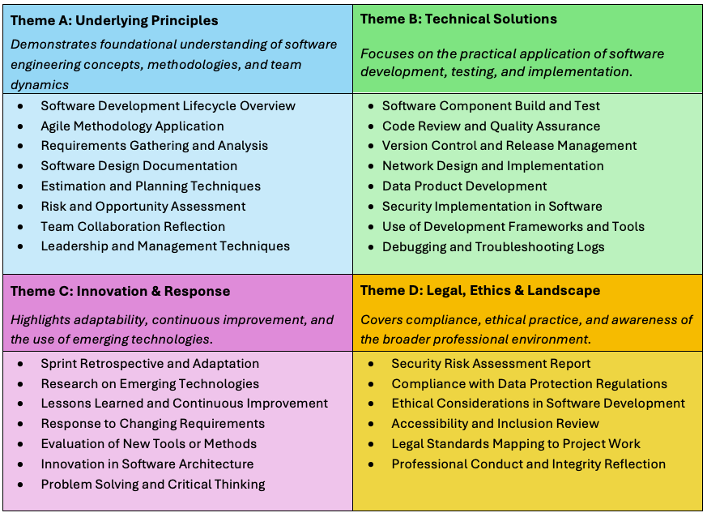
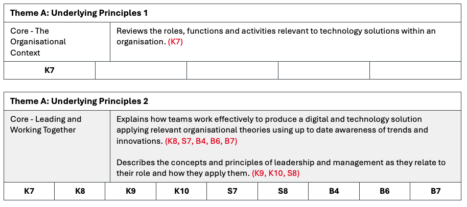
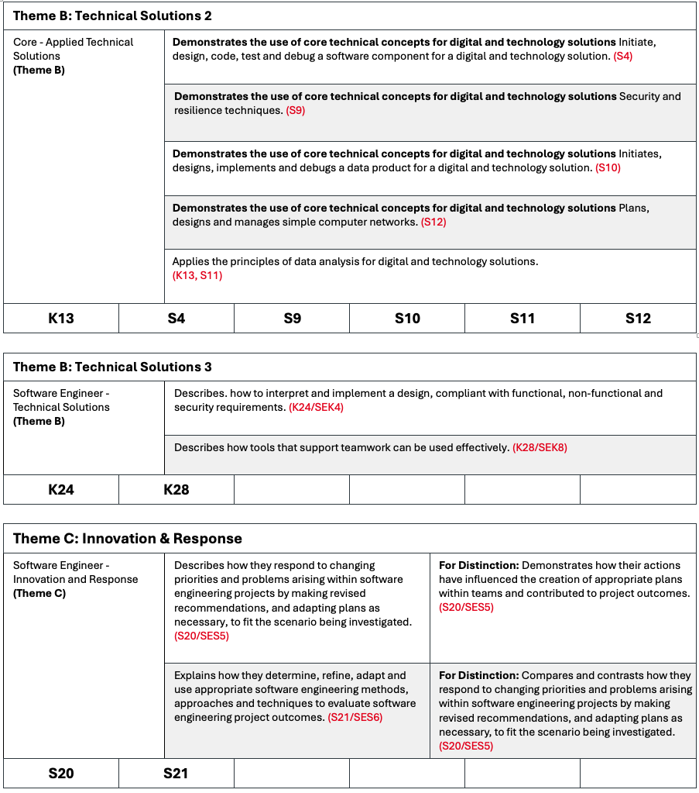

{: .no_toc }

#   Software Engineer Portfolio

*The primary role of the Software Engineer is to undertake all requirements during the solution development life cycle from gathering requirements to analysis, design, code, build, test, implementation and support. They may also be required to supervise the work of junior software developers and others who may be working on elements of the solution and work with product managers and UX designers in implementing solutions. They will apply software engineering principles to all stages of the solution life cycle, from gathering requirements, undertaking analysis and design, development of code and data requirements whilst also ensuring security feature are addressed. As well as creating new code, they can support existing code by troubleshooting, reverse engineering and conducting root cause analysis. They typically work as part of a large collaborative team and will have responsibility for significant elements of software solutions.* [Software Engineer Apprenticeship (ST0119 v1.2) 2023](https://skillsengland.education.gov.uk/apprenticeship-standards/st0119-v1-2)

Your portfolio should evidence your competence against the KSBs listed in the standard.
It must be mapped to six distinct items, each showcasing different aspects of your role and learning.

Choose projects that cover a range of activities, such as:
•	Software Engineering/development
•	Ethical and legal compliance
•	Organisational, business and team collaboration
•	Responding to change and innovation

Ensure all examples are authentic, anonymised if necessary and have organisation clearance to submit.

Explain why you did it, what you learned, and how it impacted the project or organisation.
Use reflective writing to show growth and understanding.

Include examples that show how your skills have developed over time.
Highlight how you’ve responded to feedback or adapted to new challenges.

Be ready to talk through each item, justify your decisions, and explain how they meet the KSBs.
Practice answering questions that ask you to expand, clarify, or compare your work.

###  Portfolio Evidence Overview (6x items)

This section provides a structured list of example portfolio evidence items, grouped under the four End-Point Assessment (EPA) themes defined in the Software Engineer apprenticeship standard. These examples are designed to support apprentices and employers in identifying suitable work-based projects and artefacts that demonstrate the required **Knowledge, Skills, and Behaviours (KSBs).**

Each theme reflects a key area of competence: The portfolio items listed under each theme are examples only and should be adapted to reflect the apprentice’s actual work and context. They are intended to guide the development of a strong, well-evidenced portfolio that supports a successful EPA. The apprenticeship standard outlines both core and pathway duties, each comprising a set of Knowledge, Skills, and Behaviours (KSBs) aligned to specific criteria or activities. These may also be helpful when selecting appropriate portfolio items for documentation.

Throughout the apprenticeship you will need to collate a portfolio of work mapped to the Standard’s KSBs, in Gateway COM628 module, the final on-programme module in 3rd (Level 6), you will submit a Portfolio of select a final 6 discrete pieces for the Professional Discussion underpinned by a portfolio assessment element 2 (AE2)

* apprentices must compile a portfolio of evidence during the on-programme period of the apprenticeship.
* it must contain evidence related to the KSBs that will be assessed by the professional discussion.
* **the portfolio of evidence will typically contain 6 discrete pieces of evidence.**
* evidence must be mapped against the KSBs.
evidence may be used to demonstrate more than one KSB; a qualitative as opposed to quantitative approach is suggested.
* evidence sources may include:
* workplace documentation/records, for example workplace policies/procedures, records
* witness statements
* assignments
* annotated photographs
* video clips (maximum total duration 10 minutes); the apprentice must be in view and identifiable.

**This is not a definitive list; other evidence sources are possible.**

* **Although it is expected that apprentices at degree level will be reflective in their practice, it should be noted that the EPA assesses individuals on evidence of output against the KSBs, not reflective accounts, or any methods of self-assessment.**
* any employer contributions should focus on direct observation of performance (for example witness statements) rather than opinions.
* the evidence provided must be valid and attributable to the apprentice; the portfolio of evidence must contain a statement from the employer and apprentice confirming this.
* the portfolio of evidence must be submitted to the EPAO at the gateway.

**The portfolio of evidence is not directly assessed. It underpins the professional discussion and will not be marked by the EPAO (Southampton Solent University). Solent will review the portfolio of evidence in preparation for the professional discussion but is not required to provide feedback after this portfolio review.**

### Strategies for Demonstrating Knowledge, Skills & Behaviours

1.	**Use real-world, work-based examples** only no academic tasks, hobby projects, or generic online learning examples.

2.	**Speak and Write in First Person** - Always focus on **your individual contributions** use **“I”** not “we” to clearly show your personal contribution. Even in team projects, emphasise your role and decisions.
Examples: **“I volunteered to…”, “I conducted research that informed the decision…” **

3.	**Be Explicit for the Assessor** - Don’t assume they know your workplace or role. Spell out exactly what you did to meet the KSBs. Anything left unsaid won’t be assessed. 

4.	**Mirror the Assessment Plan Language** - Adopt phrases directly from the guidance (e.g. “I demonstrated my ability to…”) to make it clear how you've met specific criteria. 

5.	**Reflect on the What and the Why** - For each example, clearly explain what you did and why you did it. Generic statements are insufficient. 

6.	**Use Key Phrases to Show Depth** - Clearly explain decisions, reasoning, and outcomes, not just the task done. Focus your language around **“what”** and **“why”**, such as “I analysed, I evaluated, I implemented... because...” to enhance clarity and impact. 

7.	**Add Depth for Distinction** - To achieve higher grades, go beyond what you did and reflect on outcomes, emphasise initiative, problem-solving, and measurable results, lessons learned, and how you would refine or improve further. Demonstrate insight into future application and organisational influence.

8.	**Evidence Best Practices**
* **Use visual evidence** (screenshots, dashboards, visuals) wherever possible
* Ensure all images are **captioned** and relate clearly to your narrative.
* Apply **GDPR-compliant techniques:**
* **Redact** sensitive data.
* **Anonymise names**, addresses, IDs.
* **Normalise data** to show trends without revealing exact figures.

9.	**Demonstrating Competency**
•	Describe technical tasks in enough detail to be replicated.
•	Justify your decisions: e.g., why a tool was chosen or why certain data was excluded.
•	If results are not yet available, update portfolio pieces later — it’s a living document until submission.

10.	 **What NOT to Include**
•	Names of others — use initials or job titles.
•	Negative remarks or personal commentary.
•	Content not directly relevant to demonstrating your professional competency.
 
**Summary**

| **Strategy** | **What to do** |
|----|----|
| First person | Emphasise **your** actions and contributions |
| Explicit detail | Explain *exactly* what you did and why |
| Mirror plan language | Use phrasing from the assessment plan |
| Legal & Professional | Address all relevant Legal & Professional issues |
| Reflect deeply | Show insight on decisions and outcomes |
| Practice & feedback | Use mock discussions and review videos |
| STAR format\* | Structure responses clearly: Situation, Task, Action, Result |

\* The **STAR format** is a structured method for answering behavioural interview questions or presenting professional experiences, often used in performance reviews or assessments. It stands for: **Situation – Task – Action – Result.** 

**Note:** There is no obligation to use this method, only consider it if you find it helpful. It is included here because it often appears in searches for best practices in presenting apprenticeship portfolios and conducting professional discussion assessments at all levels.  

[AMAZON, 2025. Interview Loop - The STAR method](https://amazon.jobs/content/en/how-we-hire/interview-loop)

### What to Expect in the Portfolio Professional Discussion EPA Assessment (AE2)

**Professional Discussion – Overview**
The professional discussion is a formal, two-way conversation between the apprentice and an independent assessor. It allows the apprentice to demonstrate the knowledge, skills and behaviours (KSBs) mapped to this assessment method, using examples from their portfolio of evidence. While the portfolio supports the discussion, it is not directly assessed.

**This method is chosen due to:**
The broad scope of the standard, allowing evidence to be drawn from across the programme.
The opportunity to explore the apprentice’s depth of understanding in specialist areas.

**Professional Discussion Structure**
The professional discussion follows a semi-structured format. The assessor leads the introduction, while the apprentice leads the dialogue, using their evidence portfolio

* **Introduction (5 minutes)** The assessor explains the process, checks ID, and outlines the session. This time is not included in the assessment duration.

* **Main Discussion (60 minutes +10%)** The apprentice leads the dialogue, referring to their portfolio to support their responses.

* Questions: A minimum of 4 questions will be asked, with follow-ups for clarification.

**Themes:** Questions will explore:
* Underlying Principles
* Technical Solutions
* Innovation & Response
* Legal, Ethics & Landscape

**Closure:** Opportunity for final reflections or clarifications.

*  **Delivery and Preparation**
The assessment is conducted remotely via video call.

**Apprentices should:**
* Book or be in a quiet, private room.
* Use a computer with a webcam, microphone, and stable internet.
* Have their portfolio ready for reference.

The assessor will guide the session and ensure the apprentice can achieve the highest possible grade.

### KSBs Assessed via Professional Discussion 

These are KSB learning outcomes that will need to be mapped to in this assessment for full details on KSB Professional Discussion assessment (Appendix A)

| Category | Type | KSBs |
|----|----|----|
| Core | Knowledge | K6, K7, K8, K9, K10, K11, K12, K13, K14, K16, K19, K20 |
| Core | Skills | S4, S7, S8, S9, S10, S11, S12, S15 |
| Core | Behaviours | B1, B2, B4, B6, B7, B8 |
| Software Engineer | Knowledge | K21, K22, K23, K24, K28 |
| Software Engineer | Skills | S20, S21, S23 |

**Note:** The documentation within the standard also refers to pathway learning outcomes using different codes; however, these are equivalent to the ones listed below. The following is a consolidated list of the main knowledge and skills outcomes, along with their corresponding pathway learning outcome codes as presented in the standard documentation.

K21 (SEK1), K22 (SEK2), K23 (SEK3), K24 (SEK4), K25 (SEK5), K26 (SEK6), K27 (SEK7), K28 (SEK8)
S16 (SES1), S17 (SES2), K18 (SES3), K19 (SES4), K20 (SES5), K21 (SES6), K22 (SES7), K23 (SES8)

### Grading Professional Discussion EPA Assessment (AE2)

This is the second of two EPA assessment elements, and it has its own grading rubric (Appendix B). You’ll receive a grade of Distinction, Pass or Fail for each element, which will contribute to your overall result as shown in the column on the right. A numeric score will also be given for both assessments, and these will be used to calculate your overall degree average and classification in line with university guidelines.

| **Project Report   with presentation, questions and answers** | **Professional   Discussion underpinned by a portfolio** | **Overall Grading** |
| :------------------------------------------------------------ | :-------------------------------------------------------- | :------------------- |
| **Fail**                                                     | **Any grade**                                            | **Fail**            |
| **Any grade**                                                | **Fail**                                                 | **Fail**            |
| **Pass**                                                     | **Pass**                                                 | **Pass**            |
| **Pass**                                                     | **Distinction**                                          | **Merit**           |
| **Distinction**                                              | **Pass**                                                 | **Merit**           |
| **Distinction**                                              | **Distinction**                                          | **Distinction**     |

### EPA Portfolio Template
Throughout your apprenticeship, you will be continuously mapping your learning from on-programme modules and capturing potential evidence and documentation for your work-based portfolio. This process will use the provided template and will help you build a mental model of how your work aligns with the required Knowledge, Skills, and Behaviours (KSBs), all linked to your upskilling and learning activities.

As you approach the End-Point Assessment (EPA), you will need to select **six of your strongest portfolio items.** For each item, you will create a narrative documentation that clearly links the work to the relevant KSBs for the **Professional Discussion (AE2).**

You will be given a template to support this process. Below is an example of one of the sections (or "blocks") included in the template. These blocks (Appendix C) are designed to help you:

* Map your work to the appropriate KSBs
* Apply the correct assessment criteria
* Ensure coverage of **all required themes** within the assessment

This structured approach will help you demonstrate your competence and readiness for the EPA.

**Using KSB Theme Blocks in Your Portfolio Template**
The portfolio template includes blocks outlining the assessment criteria and the Core and Pathway (Specialism) KSBs for each of the four required themes.
These blocks should be copied and pasted at the end of the narrative for each of your six portfolio items.

Image: Example of Theme (KSB) block

**Apprenticeship Statement of Authenticity**

Before submission, both apprentice and employer must complete a **Statement of Authenticity** at the end of this Portfolio Template document. This confirms that the work is your own and reflects your learning and development throughout the programme.

Any organisational clearance or rights to publishing must be discussed with the Solent support tutors before the Gateway submission for this assessment.

**<EXAMPLE FOR THEME-A PORTFOLIO ITEM - START>**

{: .important }
> This is a suggested layout; you may adopt a different structure, provided it is applied consistently across all six portfolio items. Please note yellow highlights indicate where diagrams and links to supporting evidence will appear in the final portfolio and KSB theme blocks have been appended to the end of the narrative description.

Item 1	Applying the Software Development Lifecycle in an Agile Environment
My Role in Delivering a Digital Solution Using the Software Development Lifecycle

**Overview:**
In this portfolio item, I demonstrate my understanding of the Software Development Lifecycle (SDLC) and how I applied it within a cross-functional Agile team to deliver a digital solution that automated a manual reporting process. This example aligns with **Theme A: Underlying Principles**, specifically focusing on **[K7, K8, K9, K10, S7, S8, B4, B6, B7].**

{: .highlight }
> Insert Diagram 1: Software Development Lifecycle Overview
A visual showing each SDLC phase with annotations of my contributions

**Situation:**
The organisation identified inefficiencies in its operations reporting process, which relied heavily on manual data entry and spreadsheets. I was assigned to a Scrum team tasked with developing a web-based reporting tool to streamline this workflow.

**Task:**
My responsibility was to contribute across the SDLC phases—from requirements gathering to deployment—while demonstrating my understanding of organisational context, team dynamics, and leadership principles.

**Actions:**

**Understanding the Organisational Context [K7]:**

I began by attending stakeholder meetings to understand the business drivers behind the project. I documented the roles and responsibilities of key stakeholders, including the Product Owner, QA Lead, and DevOps Engineer. I analysed how each role contributed to the delivery of the solution and how organisational goals shaped our technical decisions.

{: .highlight }
> Insert Diagram 2: Team Roles and Responsibilities Map
A visual showing stakeholder roles and how they interact across the SDLC.

**Supporting Evidence (embedded or links to):**
* Stakeholder Meeting Notes (PDF) 
* Organisational Role Analysis Document (PDF)

**“I demonstrated my understanding of the organisational context by analysing the roles and functions involved in delivering the solution and evaluating how they aligned with business objectives.”**
 
**Working Effectively in a Team [K8, S7, B4, B6, B7]**

I actively participated in Agile activities such as sprint planning, daily stand-ups, and retrospectives. I used Jira to manage my tasks and Confluence to document technical decisions and share knowledge with the team.

{: .highlight }
> Insert Diagram 3: Jira Sprint Board Snapshot
Annotated screenshot showing my tasks and progress.

**Supporting Evidence (embedded or links to):**
* Jira Task Export (PDF) 
* Confluence Page: Technical Decisions

I adapted my communication style to suit different team members and took initiative to support others when blockers arose. I consistently showed respect for diverse perspectives and encouraged open dialogue during retrospectives.

{: .highlight }
>Insert Diagram 4: Retrospective Summary Chart
A visual summary of feedback received, and actions taken.

**Supporting Evidence (embedded or links to):**
•	Retrospective Notes (PDF) 
•	Team Feedback Summary

**“I demonstrated my ability to work effectively in a team by collaborating during Agile ceremonies, using tools like Jira to manage progress, and contributing to shared documentation in Confluence.”**

**Applying Leadership and Management Principles [K9, K10, S8]**

I took ownership of a feature module and coordinated with Quality Assurance (QA) and DevOps to ensure smooth integration and testing. I prioritised tasks using MoSCoW analysis and managed my time to meet sprint goals.

{: .highlight }
> Insert Diagram 5: MoSCoW Prioritisation Matrix
A table showing how I prioritised features and why.

**Supporting Evidence (embedded or links to):**
* Feature Ownership Plan (PDF) 
* MoSCoW Prioritisation Sheet

I reflected on the leadership styles within the team and evaluated how they influenced our productivity and morale. I also practiced self-leadership by setting personal development goals and seeking feedback from senior engineers.

**“I applied leadership principles by taking ownership of a feature, managing priorities, and coordinating with other roles to ensure successful delivery.”**

**Results:**
The reporting tool was successfully deployed and reduced manual effort by 60%. Stakeholders reported improved accuracy and faster turnaround times. I received positive feedback for my proactive communication and technical contributions.

**Supporting Evidence (embedded or links to):**
* Deployment Report (PDF) 
* Stakeholder Feedback Email

**Reflection and Lessons Learned:**
This experience reinforced the importance of understanding the organisational context when developing software solutions. I learned that effective collaboration and clear communication are critical to team success. If I were to repeat this project, I would introduce earlier usability testing to gather feedback sooner and refine the user experience.

**“I evaluated the outcomes of my work and identified areas for improvement, such as earlier user testing, to enhance future project delivery.”**

**KSBs Demonstrated:**
* I analysed organisational roles and their impact on technology solutions. **[K7]**
* I worked effectively in a team using Agile methodologies and collaboration tools. **[K8, S7]**
* I applied leadership and management principles in my role. **[K9, K10, S8]**
* I demonstrated professional behaviours including adaptability, collaboration, and continuous improvement. **[B4, B6, B7]**

**<EXAMPLE FOR THEME-A PORTFOLIO ITEM - END>**

### Software Engineering - KSB mapping to EPA Assessment Methods (Knowledge) - Appendix A

KSB TABLE

### Grading - Professional Discussion underpinned by a portfolio – Appendix B

This grading rubric applies to the Professional Discussion assessment, which is based on your six-item portfolio. Each item in your portfolio must clearly map to the relevant Knowledge, Skills, and Behaviours (KSBs) required for this assessment element.

Your portfolio will be submitted at the Gateway stage as you enter the End Point Assessment (EPA) period. It is essential that:
* Your portfolio aligns directly with the specified KSBs.
* You are prepared to expand on and clarify how your work demonstrates these KSBs during the discussion.
* This ensures that assessors can confidently evaluate your competence against both Pass and Distinction criteria›

| THEME KSBS                                                   | PASS APPRENTICES MUST DEMONSTRATE ALL THE PASS DESCRIPTORS   | DISTINCTION APPRENTICES MUST DEMONSTRATE ALL THE PASS DESCRIPTORS AND ALL OF THE DISTINCTION DESCRIPTORS |
| ------------------------------------------------------------ | ------------------------------------------------------------ | ------------------------------------------------------------ |
| Core - The Organisational  Context (**A: Underlying Principles)**  K7 | Reviews the roles, functions and activities relevant to technology solutions within an organisation. (K7) | N/A                                                          |
| Core - Leading and Working Together  (**A: Underlying Principles)**  K8 K9 K10   S7 S8   B4 B6 B7 | Explains how teams work effectively to produce a digital and technology solution applying relevant organisational theories using up to date awareness of trends and innovations. (K8, S7, B4, B6, B7)    Describes the concepts and principles of leadership and management as they relate to their role and how they apply them. (K9, K10, S8) | N/A                                                          |
| Core – Technical Concepts **(Theme B)**  K6 K11 K12 K14 K16 | Critically evaluates the nature and scope of common vulnerabilities in digital and technology solutions (K11)  Explains core technical concepts for digital and technology solutions, including:  · The approaches and techniques used throughout the digital and technology solution lifecycle and their applicability to an organisation’s standards and pre-existing tools. (K6)  Computer networking concepts. (K16) | N/A                                                          |
| Core - Applied Technical Solutions   **(Theme B)**  K13   S4 S9 S10 S11 S12 | Demonstrates the use of core technical concepts for digital and technology solutions, including:  Initiate, design, code, test and debug a software component for a digital and technology solution. (S4)  Security and resilience techniques. (S9)  Initiates, designs, implements and debugs a data product for a digital and technology solution. (S10)  Plans, designs and manages simple computer networks. (S12)  Applies the principles of data analysis for digital and technology solutions.   (K13, S11) | N/A                                                          |
| Software Engineer -  Technical Solutions   **(Theme B)**  K24 K28 | Describes. how to interpret and implement a design, compliant with functional, non-functional and security requirements. (K24/SEK4)  Describes how tools that support teamwork can be used effectively. (K28/SEK8) | N/A                                                          |
| Software Engineer -   Innovation and Response  **(Theme C)**  S20 S21 | Describes how they respond to changing priorities and problems arising within software engineering projects by making revised recommendations, and adapting plans as necessary, to fit the scenario being investigated. (S20/SES5)  Explains how they determine, refine, adapt and use appropriate software engineering methods, approaches and techniques to evaluate software engineering project outcomes. (S21/SES6) | Demonstrates how their actions have influenced the creation of appropriate plans within teams and contributed to project outcomes. (S20/SES5)  Compares and contrasts how they respond to changing priorities and problems arising within software engineering projects by making revised recommendations, and adapting plans as necessary, to fit the scenario being investigated. (S20/SES5) |
| Core - Social Infrastructure  \- Legal, Ethical and Sustainability  **(Theme D)**   K19 K20   S15   B1 B2 B8 | Applies relevant legal, ethical, social and professional standards to digital and technology solutions considering both technical and non-technical audiences and in line with organisational guidelines. (K19, S15, B1, B2, B5)  Explains sustainable development approaches within digital technologies as they relate to their role including diversity and inclusion. (K20, B8) | Justifies the application of relevant legal, ethical, social and professional standards to digital and technology solutions. (K19, S15)  Evaluates the impact of sustainable digital technology practices of their organisation. (K20) |
| Software Engineer -   Legal, Ethics and Landscape  **(Theme D)**   S23 | Describes how they extend and update software development knowledge with evidence from professional and academic sources by undertaking appropriate research to inform best practice and lead improvements in the organisation. (S23/SES8) | N/A                                                          |

### KSB Professional Discussion underpinned by a portfolio Mapping Block – Appendix C

KSB mapping blocks are tools used to align portfolio evidence with the specific Knowledge, Skills, and Behaviours (KSBs) required by the assessment criteria. These blocks play a crucial role in ensuring that each item in the portfolio clearly demonstrates how it meets the relevant standards.

Below are examples of Knowledge, Skills, and Behaviours (KSB) mapping blocks. These will be used in the portfolio assessment template to show how each piece of evidence supports the associated KSBs within each theme. The following examples illustrate how to use these blocks effectively throughout the assessment process.

